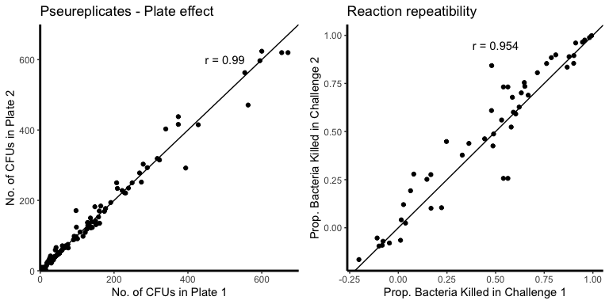

Timing of breeding shapes the trade-offs between bactericidal ability and life history in a migratory bird
================
David Chang van Oordt, Conor C. Taff, Thomas A. Ryan, Maren N. Vitousek

-   [Goals and Hypotheses](#goals-and-hypotheses)
-   [Methods](#methods)
    -   [Assay repeatability](#assay-repeatability)
    -   [Sample type comparison](#sample-type-comparison)
-   [Results](#results)
    -   [BKA in our population](#bka-in-our-population)
    -   [BKA and Reproductive Effort](#bka-and-reproductive-effort)
        -   [General trend evaluation](#general-trend-evaluation)
            -   [BKA and age](#bka-and-age)
            -   [BKA and Lay Date](#bka-and-lay-date)
        -   [Clutch Size](#clutch-size)
            -   [Clutch size data distribution](#clutch-size-data-distribution)
            -   [Clutch size models](#clutch-size-models)
        -   [Nestling Feeding Rate](#nestling-feeding-rate)
            -   [Feeding Rate variation](#feeding-rate-variation)
            -   [Including Mate provisioning](#including-mate-provisioning)
        -   [Seasonal Mass Loss](#seasonal-mass-loss)
            -   [Mass loss distribution](#mass-loss-distribution)
            -   [Mass loss models](#mass-loss-models)
    -   [BKA and reproductive success](#bka-and-reproductive-success)
        -   [Number of nestlings fledged](#number-of-nestlings-fledged)
            -   [Number fledged distribution](#number-fledged-distribution)
            -   [Number fledged models](#number-fledged-models)
        -   [Nestling mass](#nestling-mass)
            -   [Nestling mass distribution](#nestling-mass-distribution)
            -   [Nestling mass models](#nestling-mass-models)
-   [References](#references)

Goals and Hypotheses
====================

The general paradigm states that immunity trades off with life history traits. The rationale is that any energy and resources invested on immunity comes off from other bodily functions like reproduction. Here we aim to look for evidence between innate immunity and life history trade-offs in Tree Swallows (TRES, *Tachycineta bicolor*).

We have 3 central hypotheses to evaluate:

1.  Immunity trades off with the physiological response to stressors
2.  Immunity trades off with reproductive effort
3.  Trade-offs between immunity and reproductive effort lead to costs to reproductive success

We use bactericidal ability of plasma as a measure of innate immunity. bactericidal ability using blood plasma is a complement-dependent process.

Methods
=======

We performed 61 Bacteria Killing Assays (BKA) using fresh plasma from 60 female breeding TRES. We diluted 5 *μ*L of plasma in 95 *μ*L of CO2-independent medium. We then diluted it further to a 1.25% plasma-medium dilution. Each sample was then challenged with PBS containing 82 to 670 *Escherichia coli* ATCC 8739 (Microbiologics, Epower *E. coli* ATCC 8739) and left to incubate for 45 minutes in a water bath at 40° C. We then plated 50 *μ*L of the sample on a petri dish with Tryptic Soy Agar and incubated these for 12h at 37° C. We counted all the colonies that grew overnight. Each sample was challenged twice and each challenge was plated in two petri dishes. We calculated bactericidal ability as the proportion of bacteria killed based on a challenge with no plasma. The data in this study is the average of those data counts.

Assay repeatability
-------------------

We our data to assess assay repeatability across plates and sample dilutions.

``` r
# Repeatability by plate

pseurep <- bk %>%
  ggplot() + geom_point(aes(x=rep1, y=rep2)) +
  geom_abline(slope =1) +
  theme(panel.background = element_rect(fill=NA),
        axis.line = element_line(size=1),
        legend.position = "none") +
  labs(title="Pseureplicates - Plate effect",
       x = "No. of CFUs in Plate 1",
       y = "No. of CFUs in Plate 2") +
  scale_y_continuous(expand = c(0,0), limits = c(0,700)) +
  scale_x_continuous(expand = c(0,0), limits = c(0,700)) +
  annotate("text", x = 500, y = 600, 
           label = paste("r","=",
                         round(cor(cbind(bk$rep1, bk$rep2),
                                   method = "pearson")[1,2], 3) ) )

# Repeatability by reaction

reps <- inner_join(filter(bk, rxn.rep == 1) %>% select(Individual_Band, bkc),
           filter(bk, rxn.rep == 2) %>% select(Individual_Band, bkc),
           by = "Individual_Band")

rxnrep <- reps %>%
  ggplot() + geom_point(aes(x=bkc.x, y=bkc.y)) +
  geom_abline(slope =1) +
  theme(panel.background = element_rect(fill=NA),
        axis.line = element_line(size=1),
        legend.position = "none") +
  labs(title="Reaction repeatibility",
       x = "Prop. Bacteria Killed in Challenge 1",
       y = "Prop. Bacteria Killed in Challenge 2") +
  annotate("text", x = 0.5, y = 0.95, 
           label = paste("r =",round(cor(reps[,-1])[1,2], 3) ) ) 

grid.arrange(pseurep, rxnrep, ncol = 2)
```



Sample type comparison
----------------------

Since a subset of plasma samples were taken from blood samples taken 30 minutes after disturbance, we evaluated if there was a difference in BKA between these sample types.

``` r
# Boxplot
bk %>%
  group_by(Individual_Band, bleed.type) %>%
  ggplot() + geom_boxplot(aes(x = bleed.type, y = bkc, fill=bleed.type), 
                          size = 1, width = 0.25) +
  theme(panel.background = element_rect(fill=NA),
        axis.line = element_line(size=1),
        legend.position = "none") +
  labs(x = "Sample timing", y = "Prop. Bacteria Killed") +
  scale_x_discrete(labels = c("< 3 minutes", "30 min"))
```


``` r
# T-test
t.test(bkc~ bleed.type, 
       data = bk %>% group_by(Individual_Band, bleed.type) %>% 
         summarise(bkc=mean(bkc))
       ) %>% tidy() %>% kable()
```

    ## `summarise()` has grouped output by 'Individual_Band'. You can override using the `.groups` argument.
    ## `summarise()` has grouped output by 'Individual_Band'. You can override using the `.groups` argument.

<table style="width:100%;">
<colgroup>
<col width="8%" />
<col width="8%" />
<col width="8%" />
<col width="8%" />
<col width="8%" />
<col width="8%" />
<col width="9%" />
<col width="8%" />
<col width="19%" />
<col width="10%" />
</colgroup>
<thead>
<tr class="header">
<th align="right">estimate</th>
<th align="right">estimate1</th>
<th align="right">estimate2</th>
<th align="right">statistic</th>
<th align="right">p.value</th>
<th align="right">parameter</th>
<th align="right">conf.low</th>
<th align="right">conf.high</th>
<th align="left">method</th>
<th align="left">alternative</th>
</tr>
</thead>
<tbody>
<tr class="odd">
<td align="right">0.0127871</td>
<td align="right">0.4938199</td>
<td align="right">0.4810328</td>
<td align="right">0.1436736</td>
<td align="right">0.8864195</td>
<td align="right">43.64869</td>
<td align="right">-0.1666234</td>
<td align="right">0.1921976</td>
<td align="left">Welch Two Sample t-test</td>
<td align="left">two.sided</td>
</tr>
</tbody>
</table>

Results
=======

BKA in our population
---------------------

``` r
bk %>%
  group_by(Individual_Band) %>% 
  summarise(bkc = mean(bkc)) %>%
  ggplot() + geom_histogram(aes(bkc), bins = 15, colour = "white") +
  theme(panel.background = element_rect(fill=NA),
        axis.line = element_line(size=1)) +
  scale_y_continuous(limits = c(0, 10), breaks=seq(0,10,by=2),
                     expand = c(0,0)) +
  geom_vline(xintercept=0, linetype = "dashed", colour = "grey") +
  labs(x = "Prop. Bacteria Killed", y = "No. of individuals")
```


``` r
summ_bk <- group_by(bk, Individual_Band) %>% summarise(bkc = mean(bkc))
summ <- matrix(0, nrow = 1, ncol = 6)
colnames(summ) <- c("Mean", "S.D.", "2.5%", "97.5%", "Min.", "Max.")
summ[1,1] <- mean(summ_bk$bkc, na.rm = TRUE)
summ[1,2] <- sd(summ_bk$bkc, na.rm = TRUE)
summ[1,3] <- summ[1,1] - 1.96*summ[1,2]/sqrt(nrow(summ_bk))
summ[1,4] <- summ[1,1] + 1.96*summ[1,2]/sqrt(nrow(summ_bk))
summ[1,5] <- min(summ_bk)
summ[1,6] <- max(summ_bk)
kable(summ)
```

|       Mean|       S.D.|       2.5%|      97.5%|        Min.|       Max.|
|----------:|----------:|----------:|----------:|-----------:|----------:|
|  0.4850821|  0.3462755|  0.3974623|  0.5727019|  -0.1838843|  281128707|

BKA and Reproductive Effort
---------------------------

### General trend evaluation

#### BKA and age

``` r
summary(glm(bk ~ Age,  family=Gamma(link="inverse"),
            data = filter(df, Capture_Number == 1),))
```

    ## 
    ## Call:
    ## glm(formula = bk ~ Age, family = Gamma(link = "inverse"), data = filter(df, 
    ##     Capture_Number == 1))
    ## 
    ## Deviance Residuals: 
    ##     Min       1Q   Median       3Q      Max  
    ## -2.7340  -0.7319  -0.1405   0.3950   1.0823  
    ## 
    ## Coefficients:
    ##             Estimate Std. Error t value Pr(>|t|)    
    ## (Intercept)   1.7168     0.2433   7.056 2.36e-09 ***
    ## AgeSY         0.3976     0.3392   1.172    0.246    
    ## ---
    ## Signif. codes:  0 '***' 0.001 '**' 0.01 '*' 0.05 '.' 0.1 ' ' 1
    ## 
    ## (Dispersion parameter for Gamma family taken to be 0.4620108)
    ## 
    ##     Null deviance: 46.235  on 59  degrees of freedom
    ## Residual deviance: 45.611  on 58  degrees of freedom
    ## AIC: 41.409
    ## 
    ## Number of Fisher Scoring iterations: 6

#### BKA and Lay Date

``` r
summary(glm(bk ~ ylaydate, family = Gamma(link="inverse"),
                  data = filter(df, Capture_Number == 1)))
```

    ## 
    ## Call:
    ## glm(formula = bk ~ ylaydate, family = Gamma(link = "inverse"), 
    ##     data = filter(df, Capture_Number == 1))
    ## 
    ## Deviance Residuals: 
    ##     Min       1Q   Median       3Q      Max  
    ## -2.1595  -0.6537  -0.1659   0.4226   1.2263  
    ## 
    ## Coefficients:
    ##             Estimate Std. Error t value Pr(>|t|)
    ## (Intercept) -6.14992    5.59583  -1.099    0.277
    ## ylaydate     0.05848    0.04065   1.439    0.156
    ## 
    ## (Dispersion parameter for Gamma family taken to be 0.4697353)
    ## 
    ##     Null deviance: 36.675  on 54  degrees of freedom
    ## Residual deviance: 35.685  on 53  degrees of freedom
    ##   (5 observations deleted due to missingness)
    ## AIC: 35.121
    ## 
    ## Number of Fisher Scoring iterations: 6

### Clutch Size

#### Clutch size data distribution

``` r
ggplot(filter(df,Capture_Number == 1) ) +
                 geom_histogram(aes(x=Clutch_Size), 
                                colour = "white", bins = 15) +
                 theme(panel.background = element_rect(fill=NA),
                       axis.line = element_line(size=1)) +
                 scale_y_continuous(expand = c(0,0)) +
                 labs(x= "Clutch size",
                      y = "No. of individuals") +
                 scale_x_continuous(limits = c(0,8),
                                    breaks = 1:8)
```


#### Clutch size models

##### Null model

``` r
clutch_m1 <- glm(Clutch_Size ~ Age + ylaydate,
                family = quasipoisson(link = "log"), 
                data = filter(df, Capture_Number == 1))
summary(clutch_m1)
```

    ## 
    ## Call:
    ## glm(formula = Clutch_Size ~ Age + ylaydate, family = quasipoisson(link = "log"), 
    ##     data = filter(df, Capture_Number == 1))
    ## 
    ## Deviance Residuals: 
    ##      Min        1Q    Median        3Q       Max  
    ## -1.46797  -0.22972   0.01604   0.19413   0.77806  
    ## 
    ## Coefficients:
    ##              Estimate Std. Error t value Pr(>|t|)    
    ## (Intercept)  3.776722   0.629594   5.999 1.93e-07 ***
    ## AgeSY       -0.074761   0.041605  -1.797  0.07815 .  
    ## ylaydate    -0.014752   0.004565  -3.231  0.00214 ** 
    ## ---
    ## Signif. codes:  0 '***' 0.001 '**' 0.01 '*' 0.05 '.' 0.1 ' ' 1
    ## 
    ## (Dispersion parameter for quasipoisson family taken to be 0.121536)
    ## 
    ##     Null deviance: 8.6696  on 54  degrees of freedom
    ## Residual deviance: 6.7753  on 52  degrees of freedom
    ##   (5 observations deleted due to missingness)
    ## AIC: NA
    ## 
    ## Number of Fisher Scoring iterations: 4

##### BKA model

``` r
clutch_m2 <- glm(Clutch_Size ~ Bacteria_Killing_Assay + Age + ylaydate,
                family = quasipoisson(link = "log"), 
                data = filter(df, Capture_Number == 1))
summary(clutch_m2)
```

    ## 
    ## Call:
    ## glm(formula = Clutch_Size ~ Bacteria_Killing_Assay + Age + ylaydate, 
    ##     family = quasipoisson(link = "log"), data = filter(df, Capture_Number == 
    ##         1))
    ## 
    ## Deviance Residuals: 
    ##      Min        1Q    Median        3Q       Max  
    ## -1.43952  -0.22135   0.02294   0.18031   0.76309  
    ## 
    ## Coefficients:
    ##                         Estimate Std. Error t value Pr(>|t|)    
    ## (Intercept)             3.711299   0.641239   5.788  4.4e-07 ***
    ## Bacteria_Killing_Assay -0.039756   0.061788  -0.643  0.52283    
    ## AgeSY                  -0.073514   0.041917  -1.754  0.08547 .  
    ## ylaydate               -0.014149   0.004685  -3.020  0.00395 ** 
    ## ---
    ## Signif. codes:  0 '***' 0.001 '**' 0.01 '*' 0.05 '.' 0.1 ' ' 1
    ## 
    ## (Dispersion parameter for quasipoisson family taken to be 0.1231126)
    ## 
    ##     Null deviance: 8.6696  on 54  degrees of freedom
    ## Residual deviance: 6.7245  on 51  degrees of freedom
    ##   (5 observations deleted due to missingness)
    ## AIC: NA
    ## 
    ## Number of Fisher Scoring iterations: 4

##### Interaction model

``` r
clutch_m3 <- glm(Clutch_Size ~ Bacteria_Killing_Assay*ylaydate + Age,
                 family = quasipoisson(link = "log"), 
                 data = filter(df, Capture_Number == 1))
summary(clutch_m3)
```

    ## 
    ## Call:
    ## glm(formula = Clutch_Size ~ Bacteria_Killing_Assay * ylaydate + 
    ##     Age, family = quasipoisson(link = "log"), data = filter(df, 
    ##     Capture_Number == 1))
    ## 
    ## Deviance Residuals: 
    ##      Min        1Q    Median        3Q       Max  
    ## -1.18351  -0.22477  -0.01424   0.20524   0.74097  
    ## 
    ## Coefficients:
    ##                                  Estimate Std. Error t value Pr(>|t|)  
    ## (Intercept)                      2.043645   0.984603   2.076   0.0431 *
    ## Bacteria_Killing_Assay           3.723148   1.723590   2.160   0.0356 *
    ## ylaydate                        -0.002132   0.007127  -0.299   0.7661  
    ## AgeSY                           -0.072106   0.041266  -1.747   0.0867 .
    ## Bacteria_Killing_Assay:ylaydate -0.027018   0.012363  -2.185   0.0336 *
    ## ---
    ## Signif. codes:  0 '***' 0.001 '**' 0.01 '*' 0.05 '.' 0.1 ' ' 1
    ## 
    ## (Dispersion parameter for quasipoisson family taken to be 0.1187467)
    ## 
    ##     Null deviance: 8.6696  on 54  degrees of freedom
    ## Residual deviance: 6.1541  on 50  degrees of freedom
    ##   (5 observations deleted due to missingness)
    ## AIC: NA
    ## 
    ## Number of Fisher Scoring iterations: 4

##### Model comparison

``` r
# redefine models to poisson models
clutch_m1p <- glm(Clutch_Size ~ Age + ylaydate,
                family = poisson(link = "log"), 
                data = filter(df, Capture_Number == 1))
clutch_m2p <- glm(Clutch_Size ~ Bacteria_Killing_Assay + Age + ylaydate,
                family = poisson(link = "log"), 
                data = filter(df, Capture_Number == 1))
clutch_m3p <- glm(Clutch_Size ~ Bacteria_Killing_Assay*ylaydate + Age,
                 family = poisson(link = "log"), 
                 data = filter(df, Capture_Number == 1))

ICtab(clutch_m1p, clutch_m2p, clutch_m3p, dispersion = dfun(clutch_m1p), type = "qAIC")
```

    ##            dqAIC df
    ## clutch_m3p 0.0   5 
    ## clutch_m1p 1.1   3 
    ## clutch_m2p 2.7   4

### Nestling Feeding Rate

#### Feeding Rate variation

``` r
# Note that Offset refers to Nestling Age.

ggplot(rfid_d) + 
  geom_point(aes(x= Offset, y = FemFeed, color = f_rfid), show.legend = F) + 
  geom_line(aes(x= Offset, y = FemFeed, color = f_rfid), show.legend = F) +
  scale_x_continuous(expand = c(0,0), limits = c(0,20)) +
  scale_y_continuous(expand = c(0,0)) +
  theme(panel.background = element_rect(fill=NA),
        axis.line = element_line(size=1),
        legend.position = "none") +
  labs(title="Daily provisioning visits per female",
       x = "Nestling Age",
       y = "Number of visits")
```

 \#\#\#\# Feeding Rate models

``` r
scaled_pc <- pc %>%
  mutate(scBrood_Size_Hatching = scale(Brood_Size_Hatching),
         scOffset = scale(Offset),
         scHour = scale(Hour),
         scjlaydate = scale(jlaydate),
         sctemp = scale(temp),
         scMalFeed = scale(MalFeed),
         scbkc = scale(bkc),
         Individual_Band = as.factor(Individual_Band))
```

##### For all nests

###### Null model

These models are modified from (Vitousek et al. 2018)

``` r
provisioning_m1 <- glmer(data = scaled_pc, FemFeed ~ scBrood_Size_Hatching + 
                           I(scBrood_Size_Hatching^2) + scOffset + I(scOffset^2) + 
                           scHour + I(scHour^2) + scjlaydate + sctemp + 
                           Treatment + scBrood_Size_Hatching*scOffset + 
                           (1|Individual_Band),
                         family=poisson(link="log")); 
summary(provisioning_m1)
```

    ## Generalized linear mixed model fit by maximum likelihood (Laplace
    ##   Approximation) [glmerMod]
    ##  Family: poisson  ( log )
    ## Formula: FemFeed ~ scBrood_Size_Hatching + I(scBrood_Size_Hatching^2) +  
    ##     scOffset + I(scOffset^2) + scHour + I(scHour^2) + scjlaydate +  
    ##     sctemp + Treatment + scBrood_Size_Hatching * scOffset + (1 |  
    ##     Individual_Band)
    ##    Data: scaled_pc
    ## 
    ##      AIC      BIC   logLik deviance df.resid 
    ##  48307.2  48403.3 -24139.6  48279.2     7027 
    ## 
    ## Scaled residuals: 
    ##     Min      1Q  Median      3Q     Max 
    ## -4.1653 -1.0546 -0.0786  0.9313 11.1717 
    ## 
    ## Random effects:
    ##  Groups          Name        Variance Std.Dev.
    ##  Individual_Band (Intercept) 0.01315  0.1147  
    ## Number of obs: 7041, groups:  Individual_Band, 30
    ## 
    ## Fixed effects:
    ##                                 Estimate Std. Error z value Pr(>|z|)    
    ## (Intercept)                     2.524134   0.057815  43.659  < 2e-16 ***
    ## scBrood_Size_Hatching           0.047065   0.028375   1.659   0.0972 .  
    ## I(scBrood_Size_Hatching^2)     -0.021022   0.019618  -1.072   0.2839    
    ## scOffset                       -0.031015   0.005228  -5.932 2.98e-09 ***
    ## I(scOffset^2)                  -0.245156   0.005854 -41.875  < 2e-16 ***
    ## scHour                          0.052005   0.004048  12.848  < 2e-16 ***
    ## I(scHour^2)                     0.026744   0.004907   5.450 5.04e-08 ***
    ## scjlaydate                     -0.056493   0.025524  -2.213   0.0269 *  
    ## sctemp                          0.131264   0.005103  25.722  < 2e-16 ***
    ## TreatmentControl_Control       -0.019011   0.069585  -0.273   0.7847    
    ## TreatmentPredator_Control       0.053191   0.063692   0.835   0.4036    
    ## TreatmentControl_Dull           0.143297   0.077548   1.848   0.0646 .  
    ## scBrood_Size_Hatching:scOffset -0.037268   0.004550  -8.191 2.58e-16 ***
    ## ---
    ## Signif. codes:  0 '***' 0.001 '**' 0.01 '*' 0.05 '.' 0.1 ' ' 1

    ## 
    ## Correlation matrix not shown by default, as p = 13 > 12.
    ## Use print(x, correlation=TRUE)  or
    ##     vcov(x)        if you need it

###### BKA model

``` r
# bkc model
provisioning_m2 <- glmer(data = scaled_pc, FemFeed ~ scBrood_Size_Hatching + 
                           I(scBrood_Size_Hatching^2) + scOffset + I(scOffset^2) + 
                           scHour + I(scHour^2) + scjlaydate + sctemp + 
                           Treatment + scBrood_Size_Hatching*scOffset + 
                           (1|Individual_Band) + scbkc,
                         family=poisson(link="log"))
summary(provisioning_m2)
```

    ## Generalized linear mixed model fit by maximum likelihood (Laplace
    ##   Approximation) [glmerMod]
    ##  Family: poisson  ( log )
    ## Formula: FemFeed ~ scBrood_Size_Hatching + I(scBrood_Size_Hatching^2) +  
    ##     scOffset + I(scOffset^2) + scHour + I(scHour^2) + scjlaydate +  
    ##     sctemp + Treatment + scBrood_Size_Hatching * scOffset + (1 |  
    ##     Individual_Band) + scbkc
    ##    Data: scaled_pc
    ## 
    ##      AIC      BIC   logLik deviance df.resid 
    ##  48303.7  48406.6 -24136.9  48273.7     7026 
    ## 
    ## Scaled residuals: 
    ##     Min      1Q  Median      3Q     Max 
    ## -4.1613 -1.0541 -0.0798  0.9329 11.1854 
    ## 
    ## Random effects:
    ##  Groups          Name        Variance Std.Dev.
    ##  Individual_Band (Intercept) 0.01077  0.1038  
    ## Number of obs: 7041, groups:  Individual_Band, 30
    ## 
    ## Fixed effects:
    ##                                 Estimate Std. Error z value Pr(>|z|)    
    ## (Intercept)                     2.564641   0.055088  46.556  < 2e-16 ***
    ## scBrood_Size_Hatching           0.064507   0.026742   2.412   0.0159 *  
    ## I(scBrood_Size_Hatching^2)     -0.030332   0.018217  -1.665   0.0959 .  
    ## scOffset                       -0.031120   0.005225  -5.956 2.59e-09 ***
    ## I(scOffset^2)                  -0.245177   0.005851 -41.904  < 2e-16 ***
    ## scHour                          0.052067   0.004048  12.863  < 2e-16 ***
    ## I(scHour^2)                     0.026681   0.004907   5.438 5.40e-08 ***
    ## scjlaydate                     -0.032876   0.025109  -1.309   0.1904    
    ## sctemp                          0.131151   0.005102  25.704  < 2e-16 ***
    ## TreatmentControl_Control       -0.031373   0.063541  -0.494   0.6215    
    ## TreatmentPredator_Control       0.012457   0.060240   0.207   0.8362    
    ## TreatmentControl_Dull           0.104120   0.072188   1.442   0.1492    
    ## scbkc                          -0.059141   0.023948  -2.470   0.0135 *  
    ## scBrood_Size_Hatching:scOffset -0.037252   0.004548  -8.191 2.60e-16 ***
    ## ---
    ## Signif. codes:  0 '***' 0.001 '**' 0.01 '*' 0.05 '.' 0.1 ' ' 1

    ## 
    ## Correlation matrix not shown by default, as p = 14 > 12.
    ## Use print(x, correlation=TRUE)  or
    ##     vcov(x)        if you need it

###### Interaction model

``` r
provisioning_m3 <- glmer(data = scaled_pc, FemFeed ~ scBrood_Size_Hatching + 
                            I(scBrood_Size_Hatching^2) + scOffset + I(scOffset^2) + 
                            scHour + I(scHour^2) + sctemp + 
                            Treatment + scBrood_Size_Hatching*scOffset + 
                            (1|Individual_Band) + scbkc*scjlaydate,
                          family=poisson(link="log"))
summary(provisioning_m3)
```

    ## Generalized linear mixed model fit by maximum likelihood (Laplace
    ##   Approximation) [glmerMod]
    ##  Family: poisson  ( log )
    ## Formula: FemFeed ~ scBrood_Size_Hatching + I(scBrood_Size_Hatching^2) +  
    ##     scOffset + I(scOffset^2) + scHour + I(scHour^2) + sctemp +  
    ##     Treatment + scBrood_Size_Hatching * scOffset + (1 | Individual_Band) +  
    ##     scbkc * scjlaydate
    ##    Data: scaled_pc
    ## 
    ##      AIC      BIC   logLik deviance df.resid 
    ##  48305.3  48415.0 -24136.6  48273.3     7025 
    ## 
    ## Scaled residuals: 
    ##     Min      1Q  Median      3Q     Max 
    ## -4.1614 -1.0554 -0.0808  0.9332 11.1836 
    ## 
    ## Random effects:
    ##  Groups          Name        Variance Std.Dev.
    ##  Individual_Band (Intercept) 0.01056  0.1028  
    ## Number of obs: 7041, groups:  Individual_Band, 30
    ## 
    ## Fixed effects:
    ##                                 Estimate Std. Error z value Pr(>|z|)    
    ## (Intercept)                     2.578049   0.057955  44.483  < 2e-16 ***
    ## scBrood_Size_Hatching           0.075762   0.031161   2.431  0.01504 *  
    ## I(scBrood_Size_Hatching^2)     -0.035262   0.019424  -1.815  0.06947 .  
    ## scOffset                       -0.031102   0.005225  -5.953 2.64e-09 ***
    ## I(scOffset^2)                  -0.245120   0.005851 -41.894  < 2e-16 ***
    ## scHour                          0.052085   0.004048  12.867  < 2e-16 ***
    ## I(scHour^2)                     0.026652   0.004907   5.432 5.59e-08 ***
    ## sctemp                          0.131100   0.005103  25.692  < 2e-16 ***
    ## TreatmentControl_Control       -0.042493   0.065028  -0.653  0.51346    
    ## TreatmentPredator_Control      -0.004650   0.064672  -0.072  0.94268    
    ## TreatmentControl_Dull           0.075564   0.082707   0.914  0.36091    
    ## scbkc                          -0.065171   0.025295  -2.576  0.00998 ** 
    ## scjlaydate                     -0.030236   0.025176  -1.201  0.22977    
    ## scBrood_Size_Hatching:scOffset -0.037235   0.004548  -8.187 2.67e-16 ***
    ## scbkc:scjlaydate                0.019781   0.028796   0.687  0.49212    
    ## ---
    ## Signif. codes:  0 '***' 0.001 '**' 0.01 '*' 0.05 '.' 0.1 ' ' 1

    ## 
    ## Correlation matrix not shown by default, as p = 15 > 12.
    ## Use print(x, correlation=TRUE)  or
    ##     vcov(x)        if you need it

###### Model comparison

``` r
ICtab(provisioning_m1, provisioning_m2, provisioning_m3, type = "AIC")
```

    ##                 dAIC df
    ## provisioning_m2  0.0 15
    ## provisioning_m3  1.5 16
    ## provisioning_m1  3.5 14

#### Including Mate provisioning

##### Null model

``` r
provisioning_m4 <- glmer(data = scaled_pc, FemFeed ~ scBrood_Size_Hatching + 
                           I(scBrood_Size_Hatching^2) + scOffset + I(scOffset^2) + 
                           scHour + I(scHour^2) + scjlaydate + sctemp + 
                           Treatment + scMalFeed + scBrood_Size_Hatching*scOffset + 
                           (1|Individual_Band),
                         family=poisson(link="log"),
                         control = glmerControl(optimizer = "Nelder_Mead")); 
summary(provisioning_m4)
```

    ## Generalized linear mixed model fit by maximum likelihood (Laplace
    ##   Approximation) [glmerMod]
    ##  Family: poisson  ( log )
    ## Formula: FemFeed ~ scBrood_Size_Hatching + I(scBrood_Size_Hatching^2) +  
    ##     scOffset + I(scOffset^2) + scHour + I(scHour^2) + scjlaydate +  
    ##     sctemp + Treatment + scMalFeed + scBrood_Size_Hatching *  
    ##     scOffset + (1 | Individual_Band)
    ##    Data: scaled_pc
    ## Control: glmerControl(optimizer = "Nelder_Mead")
    ## 
    ##      AIC      BIC   logLik deviance df.resid 
    ##  28888.3  28984.7 -14429.2  28858.3     4563 
    ## 
    ## Scaled residuals: 
    ##     Min      1Q  Median      3Q     Max 
    ## -4.4972 -0.9298 -0.0864  0.7842 10.6191 
    ## 
    ## Random effects:
    ##  Groups          Name        Variance Std.Dev.
    ##  Individual_Band (Intercept) 0.04206  0.2051  
    ## Number of obs: 4578, groups:  Individual_Band, 24
    ## 
    ## Fixed effects:
    ##                                 Estimate Std. Error z value Pr(>|z|)    
    ## (Intercept)                     2.200613   0.157950  13.932  < 2e-16 ***
    ## scBrood_Size_Hatching          -0.032378   0.055083  -0.588   0.5567    
    ## I(scBrood_Size_Hatching^2)      0.032780   0.042568   0.770   0.4413    
    ## scOffset                       -0.049269   0.006660  -7.398 1.39e-13 ***
    ## I(scOffset^2)                  -0.197602   0.007677 -25.741  < 2e-16 ***
    ## scHour                          0.040522   0.005094   7.955 1.79e-15 ***
    ## I(scHour^2)                     0.040509   0.006509   6.224 4.85e-10 ***
    ## scjlaydate                     -0.063380   0.052483  -1.208   0.2272    
    ## sctemp                          0.059061   0.006804   8.680  < 2e-16 ***
    ## TreatmentControl_Control        0.202587   0.165512   1.224   0.2210    
    ## TreatmentPredator_Control       0.309934   0.148464   2.088   0.0368 *  
    ## TreatmentControl_Dull           0.419452   0.181846   2.307   0.0211 *  
    ## scMalFeed                       0.209892   0.004665  44.990  < 2e-16 ***
    ## scBrood_Size_Hatching:scOffset -0.049505   0.005655  -8.754  < 2e-16 ***
    ## ---
    ## Signif. codes:  0 '***' 0.001 '**' 0.01 '*' 0.05 '.' 0.1 ' ' 1

    ## 
    ## Correlation matrix not shown by default, as p = 14 > 12.
    ## Use print(x, correlation=TRUE)  or
    ##     vcov(x)        if you need it

##### BKA model

``` r
provisioning_m5 <- glmer(data = scaled_pc, FemFeed ~ scBrood_Size_Hatching + 
                           I(scBrood_Size_Hatching^2) + scOffset + I(scOffset^2) + 
                           scHour + I(scHour^2) + scjlaydate + sctemp + 
                           Treatment + scMalFeed + scBrood_Size_Hatching*scOffset + 
                           (1|Individual_Band) + scbkc,
                         family=poisson(link="log"))
summary(provisioning_m5)
```

    ## Generalized linear mixed model fit by maximum likelihood (Laplace
    ##   Approximation) [glmerMod]
    ##  Family: poisson  ( log )
    ## Formula: FemFeed ~ scBrood_Size_Hatching + I(scBrood_Size_Hatching^2) +  
    ##     scOffset + I(scOffset^2) + scHour + I(scHour^2) + scjlaydate +  
    ##     sctemp + Treatment + scMalFeed + scBrood_Size_Hatching *  
    ##     scOffset + (1 | Individual_Band) + scbkc
    ##    Data: scaled_pc
    ## 
    ##      AIC      BIC   logLik deviance df.resid 
    ##  28889.4  28992.2 -14428.7  28857.4     4562 
    ## 
    ## Scaled residuals: 
    ##     Min      1Q  Median      3Q     Max 
    ## -4.4959 -0.9303 -0.0859  0.7825 10.6228 
    ## 
    ## Random effects:
    ##  Groups          Name        Variance Std.Dev.
    ##  Individual_Band (Intercept) 0.0414   0.2035  
    ## Number of obs: 4578, groups:  Individual_Band, 24
    ## 
    ## Fixed effects:
    ##                                 Estimate Std. Error z value Pr(>|z|)    
    ## (Intercept)                     2.220637   0.155582  14.273  < 2e-16 ***
    ## scBrood_Size_Hatching          -0.017043   0.056300  -0.303   0.7621    
    ## I(scBrood_Size_Hatching^2)      0.029265   0.042065   0.696   0.4866    
    ## scOffset                       -0.049326   0.006660  -7.406 1.30e-13 ***
    ## I(scOffset^2)                  -0.197694   0.007677 -25.752  < 2e-16 ***
    ## scHour                          0.040540   0.005094   7.959 1.74e-15 ***
    ## I(scHour^2)                     0.040528   0.006509   6.227 4.76e-10 ***
    ## scjlaydate                     -0.035004   0.061328  -0.571   0.5682    
    ## sctemp                          0.059073   0.006804   8.682  < 2e-16 ***
    ## TreatmentControl_Control        0.204987   0.164892   1.243   0.2138    
    ## TreatmentPredator_Control       0.271618   0.149405   1.818   0.0691 .  
    ## TreatmentControl_Dull           0.382574   0.180656   2.118   0.0342 *  
    ## scMalFeed                       0.209838   0.004665  44.980  < 2e-16 ***
    ## scbkc                          -0.053107   0.055736  -0.953   0.3407    
    ## scBrood_Size_Hatching:scOffset -0.049535   0.005655  -8.759  < 2e-16 ***
    ## ---
    ## Signif. codes:  0 '***' 0.001 '**' 0.01 '*' 0.05 '.' 0.1 ' ' 1

    ## 
    ## Correlation matrix not shown by default, as p = 15 > 12.
    ## Use print(x, correlation=TRUE)  or
    ##     vcov(x)        if you need it

##### Interaction model

``` r
provisioning_m6 <- glmer(data = scaled_pc, FemFeed ~ scBrood_Size_Hatching + 
                           I(scBrood_Size_Hatching^2) + scOffset + I(scOffset^2) + 
                           scHour + I(scHour^2) + sctemp + 
                           Treatment + scBrood_Size_Hatching*scOffset + scMalFeed +
                           (1|Individual_Band) + scbkc*scjlaydate,
                         family=poisson(link="log"))
summary(provisioning_m6)
```

    ## Generalized linear mixed model fit by maximum likelihood (Laplace
    ##   Approximation) [glmerMod]
    ##  Family: poisson  ( log )
    ## Formula: FemFeed ~ scBrood_Size_Hatching + I(scBrood_Size_Hatching^2) +  
    ##     scOffset + I(scOffset^2) + scHour + I(scHour^2) + sctemp +  
    ##     Treatment + scBrood_Size_Hatching * scOffset + scMalFeed +  
    ##     (1 | Individual_Band) + scbkc * scjlaydate
    ##    Data: scaled_pc
    ## 
    ##      AIC      BIC   logLik deviance df.resid 
    ##  28890.9  29000.2 -14428.4  28856.9     4561 
    ## 
    ## Scaled residuals: 
    ##     Min      1Q  Median      3Q     Max 
    ## -4.4960 -0.9297 -0.0853  0.7839 10.6226 
    ## 
    ## Random effects:
    ##  Groups          Name        Variance Std.Dev.
    ##  Individual_Band (Intercept) 0.03445  0.1856  
    ## Number of obs: 4578, groups:  Individual_Band, 24
    ## 
    ## Fixed effects:
    ##                                 Estimate Std. Error z value Pr(>|z|)    
    ## (Intercept)                     2.212220   0.153355  14.425  < 2e-16 ***
    ## scBrood_Size_Hatching          -0.055482   0.074168  -0.748   0.4544    
    ## I(scBrood_Size_Hatching^2)      0.033762   0.040546   0.833   0.4050    
    ## scOffset                       -0.049339   0.006659  -7.410 1.27e-13 ***
    ## I(scOffset^2)                  -0.197590   0.007679 -25.732  < 2e-16 ***
    ## scHour                          0.040513   0.005094   7.953 1.81e-15 ***
    ## I(scHour^2)                     0.040544   0.006509   6.229 4.69e-10 ***
    ## sctemp                          0.059079   0.006804   8.683  < 2e-16 ***
    ## TreatmentControl_Control        0.213560   0.159295   1.341   0.1800    
    ## TreatmentPredator_Control       0.323801   0.160657   2.015   0.0439 *  
    ## TreatmentControl_Dull           0.472971   0.216946   2.180   0.0292 *  
    ## scMalFeed                       0.209876   0.004665  44.990  < 2e-16 ***
    ## scbkc                          -0.015699   0.070870  -0.222   0.8247    
    ## scjlaydate                     -0.067626   0.070531  -0.959   0.3377    
    ## scBrood_Size_Hatching:scOffset -0.049562   0.005655  -8.765  < 2e-16 ***
    ## scbkc:scjlaydate               -0.055049   0.074802  -0.736   0.4618    
    ## ---
    ## Signif. codes:  0 '***' 0.001 '**' 0.01 '*' 0.05 '.' 0.1 ' ' 1

    ## 
    ## Correlation matrix not shown by default, as p = 16 > 12.
    ## Use print(x, correlation=TRUE)  or
    ##     vcov(x)        if you need it

###### Model Comparison

``` r
ICtab(provisioning_m4, provisioning_m5, provisioning_m6, type = "AIC")
```

    ##                 dAIC df
    ## provisioning_m4  0.0 15
    ## provisioning_m5  1.0 16
    ## provisioning_m6  2.6 17

### Seasonal Mass Loss

#### Mass loss distribution

``` r
df_massloss <- left_join(filter(df, Experiment == "Color_Stressor", Capture_Number == 1),
          dplyr::select(filter(df, Experiment == "Color_Stressor", Capture_Number == 3), Individual_Band, Mass), 
          by = "Individual_Band") %>%
  mutate(prop.ml = (Mass.y - Mass.x)/Mass.x)

ggplot(df_massloss) +
  geom_histogram(aes(x=prop.ml),
                 colour = "white", bins = 15) +
  theme(panel.background = element_rect(fill=NA),
        axis.line = element_line(size=1)) +
  scale_y_continuous(expand = c(0,0)) +
  labs(x= "Mass lost (g)",
       y = "No. of individuals")
```


#### Mass loss models

##### Null model

``` r
prop_mass_loss_m1 <- glm(prop.ml ~ ylaydate + Brood_Size_Hatching + Treatment2, 
                         family = gaussian(link = "identity"),
                         data = df_massloss)
summary(prop_mass_loss_m1)
```

    ## 
    ## Call:
    ## glm(formula = prop.ml ~ ylaydate + Brood_Size_Hatching + Treatment2, 
    ##     family = gaussian(link = "identity"), data = df_massloss)
    ## 
    ## Deviance Residuals: 
    ##       Min         1Q     Median         3Q        Max  
    ## -0.125458  -0.021655   0.000551   0.011703   0.136777  
    ## 
    ## Coefficients:
    ##                             Estimate Std. Error t value Pr(>|t|)
    ## (Intercept)                -0.438753   0.416215  -1.054    0.304
    ## ylaydate                    0.002032   0.002805   0.725    0.477
    ## Brood_Size_Hatching        -0.003067   0.014558  -0.211    0.835
    ## Treatment2Predator_Control  0.038530   0.033879   1.137    0.268
    ## Treatment2Control_Control   0.054186   0.037076   1.461    0.159
    ## Treatment2Control_Dull     -0.047833   0.039844  -1.201    0.243
    ## 
    ## (Dispersion parameter for gaussian family taken to be 0.003748391)
    ## 
    ##     Null deviance: 0.117014  on 26  degrees of freedom
    ## Residual deviance: 0.078716  on 21  degrees of freedom
    ##   (13 observations deleted due to missingness)
    ## AIC: -66.996
    ## 
    ## Number of Fisher Scoring iterations: 2

##### BKA model

``` r
prop_mass_loss_m2 <- glm(prop.ml ~ Bacteria_Killing_Assay + ylaydate + Brood_Size_Hatching + Treatment2, 
                         family = gaussian(link = "identity"),
                         data = df_massloss)
summary(prop_mass_loss_m2)
```

    ## 
    ## Call:
    ## glm(formula = prop.ml ~ Bacteria_Killing_Assay + ylaydate + Brood_Size_Hatching + 
    ##     Treatment2, family = gaussian(link = "identity"), data = df_massloss)
    ## 
    ## Deviance Residuals: 
    ##       Min         1Q     Median         3Q        Max  
    ## -0.108593  -0.026716   0.005867   0.020011   0.107763  
    ## 
    ## Coefficients:
    ##                             Estimate Std. Error t value Pr(>|t|)
    ## (Intercept)                -0.672249   0.443779  -1.515    0.145
    ## Bacteria_Killing_Assay     -0.052293   0.038876  -1.345    0.194
    ## ylaydate                    0.003795   0.003049   1.245    0.228
    ## Brood_Size_Hatching         0.001674   0.014714   0.114    0.911
    ## Treatment2Predator_Control  0.025108   0.034709   0.723    0.478
    ## Treatment2Control_Control   0.053084   0.036391   1.459    0.160
    ## Treatment2Control_Dull     -0.057141   0.039705  -1.439    0.166
    ## 
    ## (Dispersion parameter for gaussian family taken to be 0.003609295)
    ## 
    ##     Null deviance: 0.117014  on 26  degrees of freedom
    ## Residual deviance: 0.072186  on 20  degrees of freedom
    ##   (13 observations deleted due to missingness)
    ## AIC: -67.335
    ## 
    ## Number of Fisher Scoring iterations: 2

##### Interaction model

``` r
prop_mass_loss_m3 <- glm(prop.ml ~ Bacteria_Killing_Assay*ylaydate + Brood_Size_Hatching + Treatment2, 
                         family = gaussian(link = "identity"),
                         data = df_massloss)
summary(prop_mass_loss_m3)
```

    ## 
    ## Call:
    ## glm(formula = prop.ml ~ Bacteria_Killing_Assay * ylaydate + Brood_Size_Hatching + 
    ##     Treatment2, family = gaussian(link = "identity"), data = df_massloss)
    ## 
    ## Deviance Residuals: 
    ##       Min         1Q     Median         3Q        Max  
    ## -0.099935  -0.024376   0.006448   0.024242   0.091149  
    ## 
    ## Coefficients:
    ##                                  Estimate Std. Error t value Pr(>|t|)
    ## (Intercept)                     -1.027442   0.614107  -1.673    0.111
    ## Bacteria_Killing_Assay           1.039595   1.295010   0.803    0.432
    ## ylaydate                         0.006564   0.004495   1.460    0.161
    ## Brood_Size_Hatching             -0.005708   0.017212  -0.332    0.744
    ## Treatment2Predator_Control       0.036310   0.037399   0.971    0.344
    ## Treatment2Control_Control        0.059453   0.037426   1.589    0.129
    ## Treatment2Control_Dull          -0.040657   0.044513  -0.913    0.372
    ## Bacteria_Killing_Assay:ylaydate -0.007864   0.009323  -0.844    0.409
    ## 
    ## (Dispersion parameter for gaussian family taken to be 0.003662112)
    ## 
    ##     Null deviance: 0.11701  on 26  degrees of freedom
    ## Residual deviance: 0.06958  on 19  degrees of freedom
    ##   (13 observations deleted due to missingness)
    ## AIC: -66.327
    ## 
    ## Number of Fisher Scoring iterations: 2

##### Model comparison

``` r
ICtab(prop_mass_loss_m1, prop_mass_loss_m2, prop_mass_loss_m3, type = "AIC")
```

    ##                   dAIC df
    ## prop_mass_loss_m2 0.0  8 
    ## prop_mass_loss_m1 0.3  7 
    ## prop_mass_loss_m3 1.0  9

BKA and reproductive success
----------------------------

### Number of nestlings fledged

#### Number fledged distribution

``` r
ggplot(filter(df, Capture_Number == 1, .fledged > 0 )) +
  geom_histogram(aes(x=.fledged),
                 colour = "white", bins = 15) +
  theme(panel.background = element_rect(fill=NA),
        axis.line = element_line(size=1)) +
  scale_y_continuous(expand = c(0,0)) +
  labs(x= "Number of nestlings fledged",
       y = "No. of individuals")
```


#### Number fledged models

##### Null model

``` r
fledged_m1 <- glm(.fledged ~ Brood_Size_Hatching + ylaydate +  Treatment, 
                  family = quasipoisson(link = "log"), 
                  data = filter(df, Capture_Number == 1, .fledged > 0 ) )
summary(fledged_m1)
```

    ## 
    ## Call:
    ## glm(formula = .fledged ~ Brood_Size_Hatching + ylaydate + Treatment, 
    ##     family = quasipoisson(link = "log"), data = filter(df, Capture_Number == 
    ##         1, .fledged > 0))
    ## 
    ## Deviance Residuals: 
    ##     Min       1Q   Median       3Q      Max  
    ## -1.7041  -0.3383   0.2093   0.4389   0.7845  
    ## 
    ## Coefficients:
    ##                      Estimate Std. Error t value Pr(>|t|)  
    ## (Intercept)         -2.039744   1.938177  -1.052   0.3007  
    ## Brood_Size_Hatching  0.132490   0.060729   2.182   0.0368 *
    ## ylaydate             0.019491   0.013408   1.454   0.1561  
    ## TreatmentWater       0.107790   0.162092   0.665   0.5110  
    ## TreatmentControl_    0.002313   0.169315   0.014   0.9892  
    ## ---
    ## Signif. codes:  0 '***' 0.001 '**' 0.01 '*' 0.05 '.' 0.1 ' ' 1
    ## 
    ## (Dispersion parameter for quasipoisson family taken to be 0.4076462)
    ## 
    ##     Null deviance: 18.683  on 35  degrees of freedom
    ## Residual deviance: 14.407  on 31  degrees of freedom
    ## AIC: NA
    ## 
    ## Number of Fisher Scoring iterations: 4

##### BKA model

``` r
fledged_m2 <- glm(.fledged ~ Bacteria_Killing_Assay + Brood_Size_Hatching + 
                    ylaydate + Treatment, family = quasipoisson(link = "log"), 
                  data = filter(df, Capture_Number == 1, .fledged > 0 ) )
summary(fledged_m2)
```

    ## 
    ## Call:
    ## glm(formula = .fledged ~ Bacteria_Killing_Assay + Brood_Size_Hatching + 
    ##     ylaydate + Treatment, family = quasipoisson(link = "log"), 
    ##     data = filter(df, Capture_Number == 1, .fledged > 0))
    ## 
    ## Deviance Residuals: 
    ##     Min       1Q   Median       3Q      Max  
    ## -1.8247  -0.2897   0.1698   0.3922   0.8329  
    ## 
    ## Coefficients:
    ##                        Estimate Std. Error t value Pr(>|t|)  
    ## (Intercept)            -2.41057    1.97234  -1.222   0.2312  
    ## Bacteria_Killing_Assay -0.15499    0.16181  -0.958   0.3458  
    ## Brood_Size_Hatching     0.13745    0.06080   2.261   0.0312 *
    ## ylaydate                0.02243    0.01373   1.633   0.1129  
    ## TreatmentWater          0.10656    0.16171   0.659   0.5150  
    ## TreatmentControl_       0.02440    0.17073   0.143   0.8873  
    ## ---
    ## Signif. codes:  0 '***' 0.001 '**' 0.01 '*' 0.05 '.' 0.1 ' ' 1
    ## 
    ## (Dispersion parameter for quasipoisson family taken to be 0.4062788)
    ## 
    ##     Null deviance: 18.683  on 35  degrees of freedom
    ## Residual deviance: 14.035  on 30  degrees of freedom
    ## AIC: NA
    ## 
    ## Number of Fisher Scoring iterations: 4

##### Interaction model

``` r
fledged_m3 <- glm(.fledged ~ Bacteria_Killing_Assay*ylaydate + 
                    Brood_Size_Hatching + Treatment, 
                  family = quasipoisson(link = "log"), 
                  data = filter(df, Capture_Number == 1, .fledged > 0 ) )
summary(fledged_m3)
```

    ## 
    ## Call:
    ## glm(formula = .fledged ~ Bacteria_Killing_Assay * ylaydate + 
    ##     Brood_Size_Hatching + Treatment, family = quasipoisson(link = "log"), 
    ##     data = filter(df, Capture_Number == 1, .fledged > 0))
    ## 
    ## Deviance Residuals: 
    ##     Min       1Q   Median       3Q      Max  
    ## -1.6236  -0.3044   0.1590   0.3946   0.7601  
    ## 
    ## Coefficients:
    ##                                 Estimate Std. Error t value Pr(>|t|)  
    ## (Intercept)                     -4.59445    3.01651  -1.523   0.1386  
    ## Bacteria_Killing_Assay           5.34354    5.63804   0.948   0.3511  
    ## ylaydate                         0.03870    0.02179   1.776   0.0862 .
    ## Brood_Size_Hatching              0.12296    0.06283   1.957   0.0600 .
    ## TreatmentWater                   0.10235    0.16185   0.632   0.5321  
    ## TreatmentControl_                0.03234    0.17234   0.188   0.8525  
    ## Bacteria_Killing_Assay:ylaydate -0.03952    0.04049  -0.976   0.3372  
    ## ---
    ## Signif. codes:  0 '***' 0.001 '**' 0.01 '*' 0.05 '.' 0.1 ' ' 1
    ## 
    ## (Dispersion parameter for quasipoisson family taken to be 0.415453)
    ## 
    ##     Null deviance: 18.683  on 35  degrees of freedom
    ## Residual deviance: 13.637  on 29  degrees of freedom
    ## AIC: NA
    ## 
    ## Number of Fisher Scoring iterations: 4

##### Model comparison

``` r
# redefine models to poisson
fledged_m1p <- glm(.fledged ~ Brood_Size_Hatching + ylaydate +  Treatment, 
                  family = poisson(link = "log"), 
                  data = filter(df, Capture_Number == 1, .fledged > 0 ) )
fledged_m2p <- glm(.fledged ~ Bacteria_Killing_Assay + Brood_Size_Hatching + 
                    ylaydate + Treatment, family = poisson(link = "log"), 
                  data = filter(df, Capture_Number == 1, .fledged > 0 ) )
fledged_m3p <- glm(.fledged ~ Bacteria_Killing_Assay*ylaydate + 
                    Brood_Size_Hatching + Treatment, 
                  family = poisson(link = "log"), 
                  data = filter(df, Capture_Number == 1, .fledged > 0 ) )

ICtab(fledged_m1p, fledged_m2p, fledged_m3p, dispersion = dfun(fledged_m1p), type = "qAIC")
```

    ##             dqAIC df
    ## fledged_m1p 0.0   5 
    ## fledged_m2p 1.1   6 
    ## fledged_m3p 2.1   7

### Nestling mass

#### Nestling mass distribution

``` r
ggplot(filter(nd, Capture_Number == 1, Nestling_Fate == "Fledged")) +
  geom_histogram(aes(x = Nestling_Mass),
                 colour = "white", bins = 15) +
  theme(panel.background = element_rect(fill=NA),
        axis.line = element_line(size=1)) +
  scale_y_continuous(expand = c(0,0)) +
  labs(x= "Nestling mass at day 12 (g)",
       y = "No. of individuals")
```


#### Nestling mass models

##### Null model

``` r
nd <- nd %>%
  mutate(Unit_Box = paste(Site, Nest, sep = "_"))


nestling_m1 <- lmer(Nestling_Mass ~ Brood_Size_Hatching + 
                     ylaydate + Treatment2 + temp + (1|Unit_Box), 
                   data = filter(nd, Capture_Number == 1, 
                                 Nestling_Fate == "Fledged",
                                 Bacteria_Killing_Assay != "NA") )
summary(nestling_m1)
```

    ## Linear mixed model fit by REML. t-tests use Satterthwaite's method [
    ## lmerModLmerTest]
    ## Formula: Nestling_Mass ~ Brood_Size_Hatching + ylaydate + Treatment2 +  
    ##     temp + (1 | Unit_Box)
    ##    Data: 
    ## filter(nd, Capture_Number == 1, Nestling_Fate == "Fledged", Bacteria_Killing_Assay !=  
    ##     "NA")
    ## 
    ## REML criterion at convergence: 562.2
    ## 
    ## Scaled residuals: 
    ##      Min       1Q   Median       3Q      Max 
    ## -2.90108 -0.50326  0.06341  0.49698  3.05004 
    ## 
    ## Random effects:
    ##  Groups   Name        Variance Std.Dev.
    ##  Unit_Box (Intercept) 2.146    1.465   
    ##  Residual             3.289    1.813   
    ## Number of obs: 132, groups:  Unit_Box, 34
    ## 
    ## Fixed effects:
    ##                            Estimate Std. Error       df t value Pr(>|t|)    
    ## (Intercept)                18.04627   10.41281 23.96477   1.733 0.095932 .  
    ## Brood_Size_Hatching        -1.34529    0.34944 22.64691  -3.850 0.000834 ***
    ## ylaydate                   -0.09624    0.11263 24.17820  -0.854 0.401246    
    ## Treatment2Control_Dull     -0.91266    1.17312 23.19759  -0.778 0.444448    
    ## Treatment2Predator_Control -2.53446    1.36576 22.66705  -1.856 0.076543 .  
    ## Treatment2Predator_Dull    -1.56940    1.37326 22.26054  -1.143 0.265255    
    ## Treatment2Water            -0.64936    0.95434 20.90728  -0.680 0.503700    
    ## temp                        1.21669    0.57544 21.26182   2.114 0.046464 *  
    ## ---
    ## Signif. codes:  0 '***' 0.001 '**' 0.01 '*' 0.05 '.' 0.1 ' ' 1
    ## 
    ## Correlation of Fixed Effects:
    ##             (Intr) Br_S_H ylaydt Tr2C_D Tr2P_C Tr2P_D Trtm2W
    ## Brd_Sz_Htch -0.159                                          
    ## ylaydate    -0.744 -0.156                                   
    ## Trtmnt2Cn_D  0.171  0.149 -0.231                            
    ## Trtmnt2Pr_C  0.139  0.268 -0.009  0.463                     
    ## Trtmnt2Pr_D  0.074  0.451 -0.172  0.485  0.512              
    ## Tretmnt2Wtr  0.236  0.082 -0.365  0.630  0.492  0.541       
    ## temp         0.132  0.225 -0.748  0.098 -0.235  0.059  0.241

##### BKA model

``` r
nestling_m2 <- lmer(Nestling_Mass ~ Bacteria_Killing_Assay + 
                     Brood_Size_Hatching + temp +
                      ylaydate + Treatment2 + (1|Unit_Box), 
                   data = filter(nd, Capture_Number == 1, 
                                 Nestling_Fate == "Fledged",
                                 Bacteria_Killing_Assay != "NA") )
summary(nestling_m2)
```

    ## Linear mixed model fit by REML. t-tests use Satterthwaite's method [
    ## lmerModLmerTest]
    ## Formula: Nestling_Mass ~ Bacteria_Killing_Assay + Brood_Size_Hatching +  
    ##     temp + ylaydate + Treatment2 + (1 | Unit_Box)
    ##    Data: 
    ## filter(nd, Capture_Number == 1, Nestling_Fate == "Fledged", Bacteria_Killing_Assay !=  
    ##     "NA")
    ## 
    ## REML criterion at convergence: 560.4
    ## 
    ## Scaled residuals: 
    ##      Min       1Q   Median       3Q      Max 
    ## -2.90469 -0.49278  0.07571  0.48610  3.01971 
    ## 
    ## Random effects:
    ##  Groups   Name        Variance Std.Dev.
    ##  Unit_Box (Intercept) 2.275    1.508   
    ##  Residual             3.285    1.813   
    ## Number of obs: 132, groups:  Unit_Box, 34
    ## 
    ## Fixed effects:
    ##                            Estimate Std. Error      df t value Pr(>|t|)   
    ## (Intercept)                 17.3125    10.9901 22.1720   1.575  0.12935   
    ## Bacteria_Killing_Assay      -0.2499     0.9515 19.8695  -0.263  0.79556   
    ## Brood_Size_Hatching         -1.3362     0.3581 21.8515  -3.731  0.00117 **
    ## temp                         1.1968     0.5928 20.0308   2.019  0.05707 . 
    ## ylaydate                    -0.0876     0.1197 21.8447  -0.732  0.47189   
    ## Treatment2Control_Dull      -0.9558     1.2078 21.9654  -0.791  0.43718   
    ## Treatment2Predator_Control  -2.6066     1.4202 21.9134  -1.835  0.08006 . 
    ## Treatment2Predator_Dull     -1.6029     1.4053 21.1208  -1.141  0.26679   
    ## Treatment2Water             -0.7296     1.0179 19.8849  -0.717  0.48185   
    ## ---
    ## Signif. codes:  0 '***' 0.001 '**' 0.01 '*' 0.05 '.' 0.1 ' ' 1
    ## 
    ## Correlation of Fixed Effects:
    ##             (Intr) Bc_K_A Br_S_H temp   ylaydt Tr2C_D Tr2P_C Tr2P_D
    ## Bctr_Klln_A  0.258                                                 
    ## Brd_Sz_Htch -0.179 -0.095                                          
    ## temp         0.160  0.133  0.209                                   
    ## ylaydate    -0.762 -0.281 -0.122 -0.749                            
    ## Trtmnt2Cn_D  0.197  0.136  0.134  0.114 -0.256                     
    ## Trtmnt2Pr_C  0.181  0.193  0.244 -0.203 -0.063  0.476              
    ## Trtmnt2Pr_D  0.090  0.074  0.442  0.068 -0.186  0.490  0.516       
    ## Tretmnt2Wtr  0.292  0.289  0.051  0.267 -0.416  0.637  0.519  0.539

##### Interaction model

``` r
nestling_m3 <- lmer(Nestling_Mass ~ Bacteria_Killing_Assay*ylaydate + 
                     Brood_Size_Hatching + temp +
                      Treatment2 + (1|Unit_Box), 
                   data = filter(nd, Capture_Number == 1, 
                                 Nestling_Fate == "Fledged",
                                 Bacteria_Killing_Assay != "NA") )
summary(nestling_m3)
```

    ## Linear mixed model fit by REML. t-tests use Satterthwaite's method [
    ## lmerModLmerTest]
    ## Formula: 
    ## Nestling_Mass ~ Bacteria_Killing_Assay * ylaydate + Brood_Size_Hatching +  
    ##     temp + Treatment2 + (1 | Unit_Box)
    ##    Data: 
    ## filter(nd, Capture_Number == 1, Nestling_Fate == "Fledged", Bacteria_Killing_Assay !=  
    ##     "NA")
    ## 
    ## REML criterion at convergence: 559.7
    ## 
    ## Scaled residuals: 
    ##     Min      1Q  Median      3Q     Max 
    ## -2.8637 -0.5641  0.0054  0.4731  2.9983 
    ## 
    ## Random effects:
    ##  Groups   Name        Variance Std.Dev.
    ##  Unit_Box (Intercept) 2.040    1.428   
    ##  Residual             3.318    1.822   
    ## Number of obs: 132, groups:  Unit_Box, 34
    ## 
    ## Fixed effects:
    ##                                 Estimate Std. Error      df t value Pr(>|t|)
    ## (Intercept)                       0.9654    15.9020 19.9640   0.061 0.952196
    ## Bacteria_Killing_Assay           42.6338    31.2011 19.1392   1.366 0.187647
    ## ylaydate                          0.0301     0.1434 20.3838   0.210 0.835812
    ## Brood_Size_Hatching              -1.4985     0.3651 19.9866  -4.104 0.000552
    ## temp                              1.2382     0.5717 17.2152   2.166 0.044635
    ## Treatment2Control_Dull           -0.6239     1.1901 18.5057  -0.524 0.606310
    ## Treatment2Predator_Control       -2.3377     1.3844 18.7620  -1.689 0.107854
    ## Treatment2Predator_Dull          -1.7192     1.3579 18.4830  -1.266 0.221209
    ## Treatment2Water                  -0.6210     0.9831 17.1603  -0.632 0.535919
    ## Bacteria_Killing_Assay:ylaydate  -0.3080     0.2239 19.1018  -1.375 0.184928
    ##                                    
    ## (Intercept)                        
    ## Bacteria_Killing_Assay             
    ## ylaydate                           
    ## Brood_Size_Hatching             ***
    ## temp                            *  
    ## Treatment2Control_Dull             
    ## Treatment2Predator_Control         
    ## Treatment2Predator_Dull            
    ## Treatment2Water                    
    ## Bacteria_Killing_Assay:ylaydate    
    ## ---
    ## Signif. codes:  0 '***' 0.001 '**' 0.01 '*' 0.05 '.' 0.1 ' ' 1
    ## 
    ## Correlation of Fixed Effects:
    ##             (Intr) Bc_K_A ylaydt Br_S_H temp   Tr2C_D Tr2P_C Tr2P_D Trtm2W
    ## Bctr_Klln_A -0.740                                                        
    ## ylaydate    -0.852  0.587                                                 
    ## Brd_Sz_Htch  0.130 -0.326 -0.286                                          
    ## temp         0.066  0.059 -0.569  0.180                                   
    ## Trtmnt2Cn_D -0.021  0.207 -0.083  0.059  0.124                            
    ## Trtmnt2Pr_C  0.013  0.149  0.035  0.181 -0.193  0.490                     
    ## Trtmnt2Pr_D  0.111 -0.067 -0.189  0.438  0.063  0.464  0.497              
    ## Tretmnt2Wtr  0.136  0.087 -0.287  0.022  0.270  0.637  0.522  0.528       
    ## Bctr_Kll_A:  0.745 -1.000 -0.593  0.324 -0.056 -0.203 -0.143  0.069 -0.078

##### Model comparison

``` r
ICtab(nestling_m1, nestling_m2, nestling_m3, type = "AIC")
```

    ##             dAIC df
    ## nestling_m1  0.0 10
    ## nestling_m2  0.2 11
    ## nestling_m3  1.5 12

References
==========

Vitousek, Maren N., Conor C. Taff, Daniel R. Ardia, Jocelyn M. Stedman, Cedric Zimmer, Timothy C. Salzman, and David W. Winkler. 2018. “The Lingering Impact of Stress: Brief Acute Glucocorticoid Exposure Has Sustained, Dose-Dependent Effects on Reproduction.” *Proceedings of the Royal Society B: Biological Sciences* 285 (1882): 20180722–2. doi:[10.1098/rspb.2018.0722](https://doi.org/10.1098/rspb.2018.0722).
