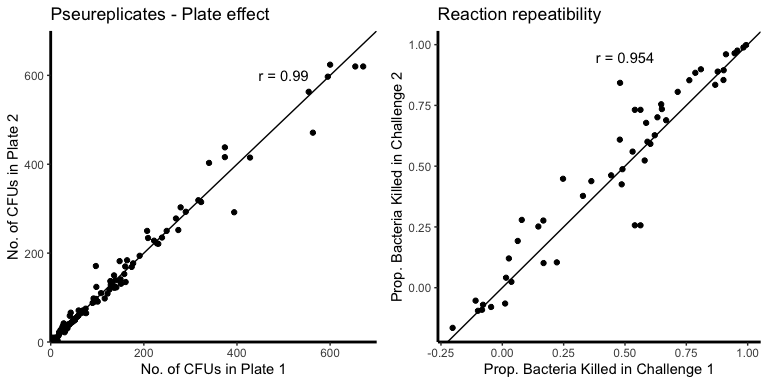

Timing of breeding reveals a trade-off between constitutive immune
investment and life history in a migratory bird
================
David Chang van Oordt, Conor C. Taff, Thomas A. Ryan, Maren N. Vitousek

-   [Method assessment](#method-assessment)
    -   [Assay repeatability](#assay-repeatability)
    -   [Treament type comparisons](#treament-type-comparisons)
-   [Results](#results)
    -   [BKA in our population](#bka-in-our-population)
    -   [BKA and Reproductive Effort](#bka-and-reproductive-effort)
        -   [General trend evaluation](#general-trend-evaluation)
            -   [BKA and age](#bka-and-age)
            -   [BKA and Lay Date](#bka-and-lay-date)
            -   [Metric covariance](#metric-covariance)
        -   [Clutch Size](#clutch-size)
            -   [Clutch size data
                distribution](#clutch-size-data-distribution)
            -   [Clutch size models](#clutch-size-models)
        -   [Nestling Feeding Rate](#nestling-feeding-rate)
            -   [Feeding Rate variation](#feeding-rate-variation)
            -   [Feeding Rate models](#feeding-rate-models)
        -   [Mass Loss](#mass-loss)
            -   [Mass loss distribution](#mass-loss-distribution)
            -   [Mass loss models](#mass-loss-models)
    -   [BKA and reproductive success](#bka-and-reproductive-success)
        -   [Fledging success](#fledging-success)
            -   [Fleding success models](#fleding-success-models)
            -   [Number of nestlings
                fledged](#number-of-nestlings-fledged)
        -   [Nestling mass](#nestling-mass)
            -   [Nestling mass
                distribution](#nestling-mass-distribution)
            -   [Nestling mass models](#nestling-mass-models)
    -   [Survival](#survival)
        -   [2020 Return Rate](#2020-return-rate)
            -   [Return rate models](#return-rate-models)
-   [References](#references)

# Method assessment

## Assay repeatability

``` r
# Repeatability by plate

pseurep <- bk %>%
  ggplot() + geom_point(aes(x=rep1, y=rep2)) +
  geom_abline(slope =1) +
  theme(panel.background = element_rect(fill=NA),
        axis.line = element_line(size=1),
        legend.position = "none") +
  labs(title="Pseureplicates - Plate effect",
       x = "No. of CFUs in Plate 1",
       y = "No. of CFUs in Plate 2") +
  scale_y_continuous(expand = c(0,0), limits = c(0,700)) +
  scale_x_continuous(expand = c(0,0), limits = c(0,700)) +
  annotate("text", x = 500, y = 600, 
           label = paste("r","=",
                         round(cor(cbind(bk$rep1, bk$rep2),
                                   method = "pearson")[1,2], 3) ) )

# Repeatability by reaction

reps <- inner_join(filter(bk, rxn.rep == 1) %>% select(Individual_Band, bkc),
           filter(bk, rxn.rep == 2) %>% select(Individual_Band, bkc),
           by = "Individual_Band")

rxnrep <- reps %>%
  ggplot() + geom_point(aes(x=bkc.x, y=bkc.y)) +
  geom_abline(slope =1) +
  theme(panel.background = element_rect(fill=NA),
        axis.line = element_line(size=1),
        legend.position = "none") +
  labs(title="Reaction repeatibility",
       x = "Prop. Bacteria Killed in Challenge 1",
       y = "Prop. Bacteria Killed in Challenge 2") +
  annotate("text", x = 0.5, y = 0.95, 
           label = paste("r =",round(cor(reps[,-1])[1,2], 3) ) ) 

grid.arrange(pseurep, rxnrep, ncol = 2)
```



## Treament type comparisons

``` r
# Boxplot
df %>% 
  mutate(timing = as.factor(
    ifelse(Experiment == "Water", "30 minutes", "<3 minutes")
  )) %>% 
  ggplot() +
  geom_boxplot(aes(x = Treatment2, y = Bacteria_Killing_Assay),
               size = 1, width = 0.25, fill = "grey") +
  geom_point(aes(x = Treatment2, y = Bacteria_Killing_Assay), 
             position = position_jitter(width = 0.1)) +
  theme(panel.background = element_rect(fill=NA),
        axis.line = element_line(size=1),
        legend.position = "none",
        legend.title.align = 0.5,
        legend.background = element_rect(fill=NA),
        axis.text.x=element_text(angle=20,hjust=1)) +
  scale_x_discrete(labels = c("Predator-Dull", "Predator-Control", "Long-term Control", "Control-Control", "Control-Dull")) +
  labs(x = "Timing of Blood Sample",
       y = "Prop. of Bacteria Killed")
```


``` r
# T-test
bka_mod1 <- lm(bk ~ Treatment2, data = df)
summary(aov(bk ~ Treatment2, data = df))
```

    ##             Df Sum Sq Mean Sq F value Pr(>F)
    ## Treatment2   4  0.158 0.03944   0.314  0.868
    ## Residuals   55  6.917 0.12576

# Results

## BKA in our population

``` r
bk %>%
  group_by(Individual_Band) %>% 
  summarise(bkc = mean(bkc)) %>%
  ggplot() + geom_histogram(aes(bkc), bins = 15, colour = "white") +
  theme(panel.background = element_rect(fill=NA),
        axis.line = element_line(size=1)) +
  scale_y_continuous(limits = c(0, 10), breaks=seq(0,10,by=2),
                     expand = c(0,0)) +
  geom_vline(xintercept=0, linetype = "dashed", colour = "grey") +
  labs(x = "Prop. Bacteria Killed", y = "No. of individuals")
```


``` r
summ_bk <- group_by(bk, Individual_Band) %>% summarise(bkc = mean(bkc))
summ <- matrix(0, nrow = 1, ncol = 6)
colnames(summ) <- c("Mean", "S.D.", "2.5%", "97.5%", "Min.", "Max.")
summ[1,1] <- mean(summ_bk$bkc, na.rm = TRUE)
summ[1,2] <- sd(summ_bk$bkc, na.rm = TRUE)
summ[1,3] <- summ[1,1] - 1.96*summ[1,2]/sqrt(nrow(summ_bk))
summ[1,4] <- summ[1,1] + 1.96*summ[1,2]/sqrt(nrow(summ_bk))
summ[1,5] <- min(summ_bk)
summ[1,6] <- max(summ_bk)
kable(summ)
```

|      Mean |      S.D. |      2.5% |     97.5% |       Min. |      Max. |
|----------:|----------:|----------:|----------:|-----------:|----------:|
| 0.4850821 | 0.3462755 | 0.3974623 | 0.5727019 | -0.1838843 | 281128707 |

## BKA and Reproductive Effort

### General trend evaluation

#### BKA and age

``` r
summary(glm(bk ~ Age,  family=Gamma(link="inverse"),
            data = df))
```

    ## 
    ## Call:
    ## glm(formula = bk ~ Age, family = Gamma(link = "inverse"), data = df)
    ## 
    ## Deviance Residuals: 
    ##     Min       1Q   Median       3Q      Max  
    ## -2.7340  -0.7319  -0.1405   0.3950   1.0823  
    ## 
    ## Coefficients:
    ##             Estimate Std. Error t value Pr(>|t|)    
    ## (Intercept)   1.7168     0.2433   7.056 2.36e-09 ***
    ## AgeSY         0.3976     0.3392   1.172    0.246    
    ## ---
    ## Signif. codes:  0 '***' 0.001 '**' 0.01 '*' 0.05 '.' 0.1 ' ' 1
    ## 
    ## (Dispersion parameter for Gamma family taken to be 0.4620108)
    ## 
    ##     Null deviance: 46.235  on 59  degrees of freedom
    ## Residual deviance: 45.611  on 58  degrees of freedom
    ## AIC: 41.409
    ## 
    ## Number of Fisher Scoring iterations: 6

#### BKA and Lay Date

``` r
ggplot() + geom_histogram(aes(df$ylaydate), bins = 15, colour = "white") +
  theme(panel.background = element_rect(fill=NA),
        axis.line = element_line(size=1)) +
  scale_y_continuous(limits = c(0, 10), breaks=seq(0,10,by=2),
                     expand = c(0,0)) +
  labs(x = "Lay Date (day of year)", y = "No. of individuals")
```


``` r
df %>%
  select(ylaydate) %>%
  summarise(mean = as.Date("2019-01-01") + mean(ylaydate), 
            median = as.Date("2019-01-01") +median(ylaydate), 
            min = as.Date("2019-01-01") + min(ylaydate),
            max = as.Date("2019-01-01") + max(ylaydate),
            Early_10p = as.Date("2019-01-01") + mean(head(sort(ylaydate), n = round(length(lay_dates)*0.1))),
            Late_10p = as.Date("2019-01-01") + mean(tail(sort(ylaydate), n = round(length(lay_dates)*0.1)))
            )
```

    ## # A tibble: 1 x 6
    ##   mean       median     min        max        Early_10p  Late_10p  
    ##   <date>     <date>     <date>     <date>     <date>     <date>    
    ## 1 2019-05-19 2019-05-20 2019-05-12 2019-05-30 2019-05-13 2019-05-27

``` r
summary(glm(bk ~ ylaydate, family = Gamma(link="inverse"),
                  data = df))
```

    ## 
    ## Call:
    ## glm(formula = bk ~ ylaydate, family = Gamma(link = "inverse"), 
    ##     data = df)
    ## 
    ## Deviance Residuals: 
    ##     Min       1Q   Median       3Q      Max  
    ## -2.7590  -0.6939  -0.1986   0.4916   1.1956  
    ## 
    ## Coefficients:
    ##             Estimate Std. Error t value Pr(>|t|)
    ## (Intercept) -5.48379    5.57535  -0.984    0.329
    ## ylaydate     0.05364    0.04041   1.328    0.190
    ## 
    ## (Dispersion parameter for Gamma family taken to be 0.4847828)
    ## 
    ##     Null deviance: 46.235  on 59  degrees of freedom
    ## Residual deviance: 45.375  on 58  degrees of freedom
    ## AIC: 41.06
    ## 
    ## Number of Fisher Scoring iterations: 6

#### Metric covariance

``` r
# covariance matrix
pc %>% 
  select(Clutch_Size, prop.ml, FemFeed, Avg_FL_Nestling_Mass, success, .fledged) %>%
  cov(use = "complete.obs")
```

    ##                      Clutch_Size      prop.ml      FemFeed Avg_FL_Nestling_Mass
    ## Clutch_Size           0.65066273 -0.011022570  0.447007080         -0.256795783
    ## prop.ml              -0.01102257  0.006147807 -0.005917435          0.002621995
    ## FemFeed               0.44700708 -0.005917435 40.682099027         -0.995427675
    ## Avg_FL_Nestling_Mass -0.25679578  0.002621995 -0.995427675          3.477427369
    ## success               0.00000000  0.000000000  0.000000000          0.000000000
    ## .fledged              0.22087936  0.048205799  0.723352081         -0.536335723
    ##                      success   .fledged
    ## Clutch_Size                0  0.2208794
    ## prop.ml                    0  0.0482058
    ## FemFeed                    0  0.7233521
    ## Avg_FL_Nestling_Mass       0 -0.5363357
    ## success                    0  0.0000000
    ## .fledged                   0  1.3688943

``` r
# correlation matrix
pc %>% 
  select(Clutch_Size, prop.ml, FemFeed, Avg_FL_Nestling_Mass, success, .fledged) %>%
  mutate(success = as.numeric(success)) %>%
  cor(use = "complete.obs")
```

    ##                      Clutch_Size     prop.ml     FemFeed Avg_FL_Nestling_Mass
    ## Clutch_Size           1.00000000 -0.17427890  0.08688299          -0.17071862
    ## prop.ml              -0.17427890  1.00000000 -0.01183237           0.01793258
    ## FemFeed               0.08688299 -0.01183237  1.00000000          -0.08369105
    ## Avg_FL_Nestling_Mass -0.17071862  0.01793258 -0.08369105           1.00000000
    ## success                       NA          NA          NA                   NA
    ## .fledged              0.23404114  0.52547761  0.09693109          -0.24582313
    ##                      success    .fledged
    ## Clutch_Size               NA  0.23404114
    ## prop.ml                   NA  0.52547761
    ## FemFeed                   NA  0.09693109
    ## Avg_FL_Nestling_Mass      NA -0.24582313
    ## success                    1          NA
    ## .fledged                  NA  1.00000000

### Clutch Size

#### Clutch size data distribution

``` r
ggplot(df) +
  geom_histogram(aes(x=Clutch_Size), colour = "white", bins = 15) +
  theme(panel.background = element_rect(fill=NA),
        axis.line = element_line(size=1)) +
  scale_y_continuous(expand = c(0,0)) +
  labs(x= "Clutch size",
       y = "No. of individuals") +
  scale_x_continuous(limits = c(0,8),
                                    breaks = 1:8)
```


#### Clutch size models

##### Null model

``` r
clutch_m1 <- glm(Clutch_Size ~ Age + ylaydate,
                family = quasipoisson(link = "log"), 
                data = df)
summary(clutch_m1)
```

    ## 
    ## Call:
    ## glm(formula = Clutch_Size ~ Age + ylaydate, family = quasipoisson(link = "log"), 
    ##     data = df)
    ## 
    ## Deviance Residuals: 
    ##      Min        1Q    Median        3Q       Max  
    ## -1.49967  -0.20721   0.01626   0.19048   0.79329  
    ## 
    ## Coefficients:
    ##              Estimate Std. Error t value Pr(>|t|)    
    ## (Intercept)  3.692395   0.610564   6.048  1.2e-07 ***
    ## AgeSY       -0.091341   0.039065  -2.338  0.02291 *  
    ## ylaydate    -0.014077   0.004417  -3.187  0.00234 ** 
    ## ---
    ## Signif. codes:  0 '***' 0.001 '**' 0.01 '*' 0.05 '.' 0.1 ' ' 1
    ## 
    ## (Dispersion parameter for quasipoisson family taken to be 0.1175148)
    ## 
    ##     Null deviance: 9.2551  on 59  degrees of freedom
    ## Residual deviance: 7.1867  on 57  degrees of freedom
    ## AIC: NA
    ## 
    ## Number of Fisher Scoring iterations: 4

##### BKA model

``` r
clutch_m2 <- glm(Clutch_Size ~ Bacteria_Killing_Assay + Age + ylaydate,
                family = quasipoisson(link = "log"), 
                data = df)
summary(clutch_m2)
```

    ## 
    ## Call:
    ## glm(formula = Clutch_Size ~ Bacteria_Killing_Assay + Age + ylaydate, 
    ##     family = quasipoisson(link = "log"), data = df)
    ## 
    ## Deviance Residuals: 
    ##      Min        1Q    Median        3Q       Max  
    ## -1.44530  -0.19636   0.02834   0.16755   0.76566  
    ## 
    ## Coefficients:
    ##                        Estimate Std. Error t value Pr(>|t|)    
    ## (Intercept)             3.60270    0.61444   5.863 2.53e-07 ***
    ## Bacteria_Killing_Assay -0.06489    0.05703  -1.138   0.2600    
    ## AgeSY                  -0.08525    0.03941  -2.163   0.0348 *  
    ## ylaydate               -0.01323    0.00447  -2.961   0.0045 ** 
    ## ---
    ## Signif. codes:  0 '***' 0.001 '**' 0.01 '*' 0.05 '.' 0.1 ' ' 1
    ## 
    ## (Dispersion parameter for quasipoisson family taken to be 0.1173973)
    ## 
    ##     Null deviance: 9.2551  on 59  degrees of freedom
    ## Residual deviance: 7.0351  on 56  degrees of freedom
    ## AIC: NA
    ## 
    ## Number of Fisher Scoring iterations: 4

##### Interaction model

``` r
clutch_m3 <- glm(Clutch_Size ~ Bacteria_Killing_Assay*ylaydate + Age,
                 family = quasipoisson(link = "log"), 
                 data = df)
summary(clutch_m3)
```

    ## 
    ## Call:
    ## glm(formula = Clutch_Size ~ Bacteria_Killing_Assay * ylaydate + 
    ##     Age, family = quasipoisson(link = "log"), data = df)
    ## 
    ## Deviance Residuals: 
    ##      Min        1Q    Median        3Q       Max  
    ## -1.18629  -0.20471   0.01383   0.17487   0.74587  
    ## 
    ## Coefficients:
    ##                                  Estimate Std. Error t value Pr(>|t|)  
    ## (Intercept)                      1.984922   0.938139   2.116   0.0389 *
    ## Bacteria_Killing_Assay           3.663823   1.665632   2.200   0.0321 *
    ## ylaydate                        -0.001609   0.006769  -0.238   0.8130  
    ## AgeSY                           -0.081385   0.038846  -2.095   0.0408 *
    ## Bacteria_Killing_Assay:ylaydate -0.026740   0.011934  -2.241   0.0291 *
    ## ---
    ## Signif. codes:  0 '***' 0.001 '**' 0.01 '*' 0.05 '.' 0.1 ' ' 1
    ## 
    ## (Dispersion parameter for quasipoisson family taken to be 0.1133617)
    ## 
    ##     Null deviance: 9.2551  on 59  degrees of freedom
    ## Residual deviance: 6.4620  on 55  degrees of freedom
    ## AIC: NA
    ## 
    ## Number of Fisher Scoring iterations: 4

##### Model comparison and average

``` r
# redefine models to poisson models
clutch_m1p <- glm(Clutch_Size ~ Age + ylaydate,
                family = poisson(link = "log"), 
                data = df)
clutch_m2p <- glm(Clutch_Size ~ Bacteria_Killing_Assay + Age + ylaydate,
                family = poisson(link = "log"), 
                data = df)
clutch_m3p <- glm(Clutch_Size ~ Bacteria_Killing_Assay*ylaydate + Age,
                 family = poisson(link = "log"), 
                 data = df)

# ICtab(clutch_m1p, clutch_m2p, clutch_m3p, dispersion = dfun(clutch_m1p), nobs = nrow(df), type = "qAICc")

disp = dfun(clutch_m3)

# updated qAICc in models for averaging
clutch_m1$aic <- update.qAICc(clutch_m1p, dispersion = disp)
clutch_m2$aic <- update.qAICc(clutch_m2p, dispersion = disp)
clutch_m3$aic <- update.qAICc(clutch_m3p, dispersion = disp)

summary(model.avg(clutch_m1, clutch_m2, clutch_m3, revised.var = TRUE))
```

    ## 
    ## Call:
    ## model.avg(object = clutch_m1, clutch_m2, clutch_m3, revised.var = TRUE)
    ## 
    ## Component model call: 
    ## glm(formula = <3 unique values>, family = quasipoisson(link = "log"), 
    ##      data = df)
    ## 
    ## Component models: 
    ##      df  logLik    AICc delta weight
    ## 1234  5 -966.37 1943.86  0.00   0.50
    ## 13    3 -969.14 1944.71  0.85   0.33
    ## 123   4 -968.66 1946.05  2.20   0.17
    ## 
    ## Term codes: 
    ##                             Age          Bacteria_Killing_Assay 
    ##                               1                               2 
    ##                        ylaydate Bacteria_Killing_Assay:ylaydate 
    ##                               3                               4 
    ## 
    ## Model-averaged coefficients:  
    ## (full average) 
    ##                                  Estimate Std. Error Adjusted SE z value
    ## (Intercept)                      2.817617   1.154600    1.166815   2.415
    ## Bacteria_Killing_Assay           1.833882   2.189506    2.203975   0.832
    ## ylaydate                        -0.007658   0.008368    0.008456   0.906
    ## AgeSY                           -0.085305   0.039264    0.040123   2.126
    ## Bacteria_Killing_Assay:ylaydate -0.013464   0.015826    0.015929   0.845
    ##                                 Pr(>|z|)  
    ## (Intercept)                       0.0157 *
    ## Bacteria_Killing_Assay            0.4054  
    ## ylaydate                          0.3651  
    ## AgeSY                             0.0335 *
    ## Bacteria_Killing_Assay:ylaydate   0.3980  
    ##  
    ## (conditional average) 
    ##                                  Estimate Std. Error Adjusted SE z value
    ## (Intercept)                      2.817617   1.154600    1.166815   2.415
    ## Bacteria_Killing_Assay           2.731893   2.165214    2.186972   1.249
    ## ylaydate                        -0.007658   0.008368    0.008456   0.906
    ## AgeSY                           -0.085305   0.039264    0.040123   2.126
    ## Bacteria_Killing_Assay:ylaydate -0.026740   0.011934    0.012202   2.191
    ##                                 Pr(>|z|)  
    ## (Intercept)                       0.0157 *
    ## Bacteria_Killing_Assay            0.2116  
    ## ylaydate                          0.3651  
    ## AgeSY                             0.0335 *
    ## Bacteria_Killing_Assay:ylaydate   0.0284 *
    ## ---
    ## Signif. codes:  0 '***' 0.001 '**' 0.01 '*' 0.05 '.' 0.1 ' ' 1

``` r
#plot data
n = 3

new_data <- tibble(ylaydate = rep(lay_groups, each = 100),
                   Age = rep("ASY", n*100),
                   Bacteria_Killing_Assay = rep(seq(-0.2,1,length.out = 100), n))
plot_data_clutch_ld <- cbind(predict(clutch_m3,new_data,
                           type = "response", se.fit = TRUE), new_data) %>%
  mutate(lwr = fit - 1.96*se.fit,
         upr = fit + 1.96*se.fit)

clutch_ld <- ggplot() + 
  scale_fill_manual(name = "Lay Date",
                    values = lay_colors, 
                     labels = c("Earliest 10%", "Mean", "Latest 10%"),
                     guide = guide_legend(
                       direction = "horizontal",
                       title.position = "top",
                       label.position = "bottom"
                     )) + 
  scale_color_manual(name = "Lay Date",
                      values = lay_colors,
                      labels = c("Earliest 10%", "Mean", "Latest 10%"),
                      guide = guide_legend(
                        direction = "horizontal",
                        title.position = "top",
                        label.position = "bottom"
                      )) +
  scale_linetype_manual(name = "Lay Date",
                        values = lay_lines,
                        labels = c("Earliest 10%", "Mean", "Latest 10%"),
                        guide = guide_legend(
                          direction = "horizontal",
                          title.position = "top",
                          label.position = "bottom"
                        ) ) +
  geom_vline(aes(xintercept = 0), color = "grey", linetype = "dashed", size = 0.5) +
  annotate("text", x = 0.01, y = 0.95*8, 
           label = paste("Inhibition"),
           hjust = 0, size = 2) +
  annotate("text", x = -0.015, y = 0.95*8, 
           label = paste("Growth"),
           hjust = 1, size = 2) +
  geom_point(data = df,
             aes(x = Bacteria_Killing_Assay,
                 y = Clutch_Size),
             color = "grey",
             alpha = 0.5) +
  geom_line(aes(x = plot_data_clutch_ld$Bacteria_Killing_Assay,
                y = plot_data_clutch_ld$fit, 
                group = plot_data_clutch_ld$ylaydate, colour = as.factor(plot_data_clutch_ld$ylaydate),
                linetype = as.factor(plot_data_clutch_ld$ylaydate)), 
            size = 1) +
  geom_ribbon(data = plot_data_clutch_ld, 
              aes(x = Bacteria_Killing_Assay,
                  ymin = lwr, ymax = upr,
                  group = ylaydate, fill = as.factor(ylaydate)), alpha = 0.2) +
  theme(panel.background = element_rect(fill=NA),
        axis.line = element_line(size=1),
        legend.position = c(0.5, 0.2),
        legend.background = element_rect(fill=NA),
        legend.text.align = 0.5,
        legend.title.align = 0.5,
        legend.key.width = unit(1.5,"cm"),
        legend.key = element_rect(fill = NA)) +
  labs(title = "",
       x = "Prop. of Bacteria Killed",
       y = "Clutch size (eggs)",
       color = "Lay Date",
       linetype = "Lay Date") +
  scale_x_continuous(limits = c(-0.2, 1.05), expand = c(0,0)) +
  scale_y_continuous(limits = c(0, 8), expand = c(0,0)) +
  annotate("text", x = 0.95, y = 0.95*8, 
           label = paste("n =", nrow(clutch_m2$model)),
           hjust = 1); clutch_ld
```


### Nestling Feeding Rate

#### Feeding Rate variation

``` r
# Note that Offset refers to Nestling Age.

ggplot(rfid_d) + 
  geom_point(aes(x= Offset, y = FemFeed, group = f_rfid), alpha = 0.1, show.legend = F) + 
  geom_line(aes(x= Offset, y = FemFeed, group = f_rfid), alpha = 0.1, show.legend = F) +
  geom_boxplot(aes(x = Offset, y = FemFeed, group = as.factor(Offset), fill = as.factor(Offset)),
               width = 0.3) +
  scale_x_continuous(expand = c(0,0), limits = c(0,20)) +
  scale_y_continuous(expand = c(0,0)) +
  theme(panel.background = element_rect(fill=NA),
        axis.line = element_line(size=1),
        legend.position = "none") +
  labs(title="Daily provisioning visits per female",
       x = "Nestling Age (days)",
       y = "Number of visits per day")
```


#### Feeding Rate models

``` r
scaled_pc <- pc %>%
  mutate(scBrood_Size_Hatching = scale(Brood_Size_Hatching),
         scOffset = scale(Offset),
         scHour = scale(Hour),
         scjlaydate = scale(jlaydate),
         sctemp = scale(temp),
         scMalFeed = scale(MalFeed),
         scbkc = scale(bkc),
         Individual_Band = as.factor(Individual_Band))
```

##### For all nests

###### Null model

These models are modified from (Vitousek et al. 2018)

``` r
provisioning_m1 <- glmer(data = scaled_pc, FemFeed ~ scBrood_Size_Hatching + 
                           I(scBrood_Size_Hatching^2) + scOffset + I(scOffset^2) + 
                           scHour + I(scHour^2) + scjlaydate + sctemp + 
                           Treatment + scBrood_Size_Hatching*scOffset + 
                           (1|Individual_Band),
                         family=poisson(link="log")); 
summary(provisioning_m1)
```

    ## Generalized linear mixed model fit by maximum likelihood (Laplace
    ##   Approximation) [glmerMod]
    ##  Family: poisson  ( log )
    ## Formula: FemFeed ~ scBrood_Size_Hatching + I(scBrood_Size_Hatching^2) +  
    ##     scOffset + I(scOffset^2) + scHour + I(scHour^2) + scjlaydate +  
    ##     sctemp + Treatment + scBrood_Size_Hatching * scOffset + (1 |  
    ##     Individual_Band)
    ##    Data: scaled_pc
    ## 
    ##      AIC      BIC   logLik deviance df.resid 
    ##  48307.2  48403.3 -24139.6  48279.2     7027 
    ## 
    ## Scaled residuals: 
    ##     Min      1Q  Median      3Q     Max 
    ## -4.1653 -1.0546 -0.0786  0.9313 11.1717 
    ## 
    ## Random effects:
    ##  Groups          Name        Variance Std.Dev.
    ##  Individual_Band (Intercept) 0.01315  0.1147  
    ## Number of obs: 7041, groups:  Individual_Band, 30
    ## 
    ## Fixed effects:
    ##                                 Estimate Std. Error z value Pr(>|z|)    
    ## (Intercept)                     2.524134   0.057815  43.659  < 2e-16 ***
    ## scBrood_Size_Hatching           0.047065   0.028375   1.659   0.0972 .  
    ## I(scBrood_Size_Hatching^2)     -0.021022   0.019618  -1.072   0.2839    
    ## scOffset                       -0.031015   0.005228  -5.932 2.98e-09 ***
    ## I(scOffset^2)                  -0.245156   0.005854 -41.875  < 2e-16 ***
    ## scHour                          0.052005   0.004048  12.848  < 2e-16 ***
    ## I(scHour^2)                     0.026744   0.004907   5.450 5.04e-08 ***
    ## scjlaydate                     -0.056493   0.025524  -2.213   0.0269 *  
    ## sctemp                          0.131264   0.005103  25.722  < 2e-16 ***
    ## TreatmentControl_Control       -0.019011   0.069585  -0.273   0.7847    
    ## TreatmentPredator_Control       0.053191   0.063692   0.835   0.4036    
    ## TreatmentControl_Dull           0.143297   0.077548   1.848   0.0646 .  
    ## scBrood_Size_Hatching:scOffset -0.037268   0.004550  -8.191 2.58e-16 ***
    ## ---
    ## Signif. codes:  0 '***' 0.001 '**' 0.01 '*' 0.05 '.' 0.1 ' ' 1

    ## 
    ## Correlation matrix not shown by default, as p = 13 > 12.
    ## Use print(x, correlation=TRUE)  or
    ##     vcov(x)        if you need it

###### BKA model

``` r
# bkc model
provisioning_m2 <- glmer(data = scaled_pc, FemFeed ~ scBrood_Size_Hatching + 
                           I(scBrood_Size_Hatching^2) + scOffset + I(scOffset^2) + 
                           scHour + I(scHour^2) + scjlaydate + sctemp + 
                           Treatment + scBrood_Size_Hatching*scOffset + 
                           (1|Individual_Band) + scbkc,
                         family=poisson(link="log"))
summary(provisioning_m2)
```

    ## Generalized linear mixed model fit by maximum likelihood (Laplace
    ##   Approximation) [glmerMod]
    ##  Family: poisson  ( log )
    ## Formula: FemFeed ~ scBrood_Size_Hatching + I(scBrood_Size_Hatching^2) +  
    ##     scOffset + I(scOffset^2) + scHour + I(scHour^2) + scjlaydate +  
    ##     sctemp + Treatment + scBrood_Size_Hatching * scOffset + (1 |  
    ##     Individual_Band) + scbkc
    ##    Data: scaled_pc
    ## 
    ##      AIC      BIC   logLik deviance df.resid 
    ##  48303.7  48406.6 -24136.9  48273.7     7026 
    ## 
    ## Scaled residuals: 
    ##     Min      1Q  Median      3Q     Max 
    ## -4.1613 -1.0541 -0.0798  0.9329 11.1854 
    ## 
    ## Random effects:
    ##  Groups          Name        Variance Std.Dev.
    ##  Individual_Band (Intercept) 0.01077  0.1038  
    ## Number of obs: 7041, groups:  Individual_Band, 30
    ## 
    ## Fixed effects:
    ##                                 Estimate Std. Error z value Pr(>|z|)    
    ## (Intercept)                     2.564641   0.055088  46.556  < 2e-16 ***
    ## scBrood_Size_Hatching           0.064507   0.026742   2.412   0.0159 *  
    ## I(scBrood_Size_Hatching^2)     -0.030332   0.018217  -1.665   0.0959 .  
    ## scOffset                       -0.031120   0.005225  -5.956 2.59e-09 ***
    ## I(scOffset^2)                  -0.245177   0.005851 -41.904  < 2e-16 ***
    ## scHour                          0.052067   0.004048  12.863  < 2e-16 ***
    ## I(scHour^2)                     0.026681   0.004907   5.438 5.40e-08 ***
    ## scjlaydate                     -0.032876   0.025109  -1.309   0.1904    
    ## sctemp                          0.131151   0.005102  25.704  < 2e-16 ***
    ## TreatmentControl_Control       -0.031373   0.063541  -0.494   0.6215    
    ## TreatmentPredator_Control       0.012457   0.060240   0.207   0.8362    
    ## TreatmentControl_Dull           0.104120   0.072188   1.442   0.1492    
    ## scbkc                          -0.059141   0.023948  -2.470   0.0135 *  
    ## scBrood_Size_Hatching:scOffset -0.037252   0.004548  -8.191 2.60e-16 ***
    ## ---
    ## Signif. codes:  0 '***' 0.001 '**' 0.01 '*' 0.05 '.' 0.1 ' ' 1

    ## 
    ## Correlation matrix not shown by default, as p = 14 > 12.
    ## Use print(x, correlation=TRUE)  or
    ##     vcov(x)        if you need it

###### Interaction model

``` r
provisioning_m3 <- glmer(data = scaled_pc, FemFeed ~ scBrood_Size_Hatching + 
                            I(scBrood_Size_Hatching^2) + scOffset + I(scOffset^2) + 
                            scHour + I(scHour^2) + sctemp + 
                            Treatment + scBrood_Size_Hatching*scOffset + 
                            (1|Individual_Band) + scbkc*scjlaydate,
                          family=poisson(link="log"))
summary(provisioning_m3)
```

    ## Generalized linear mixed model fit by maximum likelihood (Laplace
    ##   Approximation) [glmerMod]
    ##  Family: poisson  ( log )
    ## Formula: FemFeed ~ scBrood_Size_Hatching + I(scBrood_Size_Hatching^2) +  
    ##     scOffset + I(scOffset^2) + scHour + I(scHour^2) + sctemp +  
    ##     Treatment + scBrood_Size_Hatching * scOffset + (1 | Individual_Band) +  
    ##     scbkc * scjlaydate
    ##    Data: scaled_pc
    ## 
    ##      AIC      BIC   logLik deviance df.resid 
    ##  48305.3  48415.0 -24136.6  48273.3     7025 
    ## 
    ## Scaled residuals: 
    ##     Min      1Q  Median      3Q     Max 
    ## -4.1614 -1.0554 -0.0808  0.9332 11.1836 
    ## 
    ## Random effects:
    ##  Groups          Name        Variance Std.Dev.
    ##  Individual_Band (Intercept) 0.01056  0.1028  
    ## Number of obs: 7041, groups:  Individual_Band, 30
    ## 
    ## Fixed effects:
    ##                                 Estimate Std. Error z value Pr(>|z|)    
    ## (Intercept)                     2.578049   0.057955  44.483  < 2e-16 ***
    ## scBrood_Size_Hatching           0.075762   0.031161   2.431  0.01504 *  
    ## I(scBrood_Size_Hatching^2)     -0.035262   0.019424  -1.815  0.06947 .  
    ## scOffset                       -0.031102   0.005225  -5.953 2.64e-09 ***
    ## I(scOffset^2)                  -0.245120   0.005851 -41.894  < 2e-16 ***
    ## scHour                          0.052085   0.004048  12.867  < 2e-16 ***
    ## I(scHour^2)                     0.026652   0.004907   5.432 5.59e-08 ***
    ## sctemp                          0.131100   0.005103  25.692  < 2e-16 ***
    ## TreatmentControl_Control       -0.042493   0.065028  -0.653  0.51346    
    ## TreatmentPredator_Control      -0.004650   0.064672  -0.072  0.94268    
    ## TreatmentControl_Dull           0.075564   0.082707   0.914  0.36091    
    ## scbkc                          -0.065171   0.025295  -2.576  0.00998 ** 
    ## scjlaydate                     -0.030236   0.025176  -1.201  0.22977    
    ## scBrood_Size_Hatching:scOffset -0.037235   0.004548  -8.187 2.67e-16 ***
    ## scbkc:scjlaydate                0.019781   0.028796   0.687  0.49212    
    ## ---
    ## Signif. codes:  0 '***' 0.001 '**' 0.01 '*' 0.05 '.' 0.1 ' ' 1

    ## 
    ## Correlation matrix not shown by default, as p = 15 > 12.
    ## Use print(x, correlation=TRUE)  or
    ##     vcov(x)        if you need it

###### Model comparison and averaging

``` r
# ICtab(provisioning_m1, provisioning_m2, provisioning_m3, type = "AICc")

feeding_rate <- model.avg(provisioning_m1, provisioning_m2, provisioning_m3, revised.var = TRUE)
summary(feeding_rate)
```

    ## 
    ## Call:
    ## model.avg(object = provisioning_m1, provisioning_m2, provisioning_m3, 
    ##     revised.var = TRUE)
    ## 
    ## Component model call: 
    ## glmer(formula = FemFeed ~ <3 unique rhs>, data = scaled_pc, family = 
    ##      poisson(link = "log"))
    ## 
    ## Component models: 
    ##                            df    logLik     AICc delta weight
    ## 1/2/3/4/5/6/7/8/9/10/12    15 -24136.86 48303.79  0.00   0.61
    ## 1/2/3/4/5/6/7/8/9/10/11/12 16 -24136.63 48305.33  1.54   0.28
    ## 1/2/3/5/6/7/8/9/10/12      14 -24139.62 48307.30  3.51   0.11
    ## 
    ## Term codes: 
    ##     I(scBrood_Size_Hatching^2)                    I(scHour^2) 
    ##                              1                              2 
    ##                  I(scOffset^2)                          scbkc 
    ##                              3                              4 
    ##          scBrood_Size_Hatching                         scHour 
    ##                              5                              6 
    ##                     scjlaydate                       scOffset 
    ##                              7                              8 
    ##                         sctemp                      Treatment 
    ##                              9                             10 
    ##               scbkc:scjlaydate scBrood_Size_Hatching:scOffset 
    ##                             11                             12 
    ## 
    ## Model-averaged coefficients:  
    ## (full average) 
    ##                                 Estimate Std. Error Adjusted SE z value
    ## (Intercept)                     2.564149   0.058164    0.058173  44.078
    ## scBrood_Size_Hatching           0.065845   0.029381    0.029385   2.241
    ## I(scBrood_Size_Hatching^2)     -0.030741   0.019136    0.019139   1.606
    ## scOffset                       -0.031104   0.005226    0.005226   5.951
    ## I(scOffset^2)                  -0.245158   0.005851    0.005852  41.891
    ## scHour                          0.052065   0.004048    0.004049  12.860
    ## I(scHour^2)                     0.026679   0.004907    0.004908   5.436
    ## scjlaydate                     -0.034627   0.026297    0.026301   1.317
    ## sctemp                          0.131149   0.005103    0.005104  25.697
    ## TreatmentControl_Control       -0.033211   0.064995    0.065007   0.511
    ## TreatmentPredator_Control       0.011927   0.063943    0.063953   0.187
    ## TreatmentControl_Dull           0.100187   0.078322    0.078335   1.279
    ## scbkc                          -0.054591   0.029852    0.029855   1.829
    ## scBrood_Size_Hatching:scOffset -0.037249   0.004548    0.004549   8.188
    ## scbkc:scjlaydate                0.005595   0.017717    0.017719   0.316
    ##                                Pr(>|z|)    
    ## (Intercept)                      <2e-16 ***
    ## scBrood_Size_Hatching            0.0250 *  
    ## I(scBrood_Size_Hatching^2)       0.1082    
    ## scOffset                         <2e-16 ***
    ## I(scOffset^2)                    <2e-16 ***
    ## scHour                           <2e-16 ***
    ## I(scHour^2)                       1e-07 ***
    ## scjlaydate                       0.1880    
    ## sctemp                           <2e-16 ***
    ## TreatmentControl_Control         0.6094    
    ## TreatmentPredator_Control        0.8521    
    ## TreatmentControl_Dull            0.2009    
    ## scbkc                            0.0675 .  
    ## scBrood_Size_Hatching:scOffset   <2e-16 ***
    ## scbkc:scjlaydate                 0.7522    
    ##  
    ## (conditional average) 
    ##                                 Estimate Std. Error Adjusted SE z value
    ## (Intercept)                     2.564149   0.058164    0.058173  44.078
    ## scBrood_Size_Hatching           0.065845   0.029381    0.029385   2.241
    ## I(scBrood_Size_Hatching^2)     -0.030741   0.019136    0.019139   1.606
    ## scOffset                       -0.031104   0.005226    0.005226   5.951
    ## I(scOffset^2)                  -0.245158   0.005851    0.005852  41.891
    ## scHour                          0.052065   0.004048    0.004049  12.860
    ## I(scHour^2)                     0.026679   0.004907    0.004908   5.436
    ## scjlaydate                     -0.034627   0.026297    0.026301   1.317
    ## sctemp                          0.131149   0.005103    0.005104  25.697
    ## TreatmentControl_Control       -0.033211   0.064995    0.065007   0.511
    ## TreatmentPredator_Control       0.011927   0.063943    0.063953   0.187
    ## TreatmentControl_Dull           0.100187   0.078322    0.078335   1.279
    ## scbkc                          -0.061048   0.024542    0.024547   2.487
    ## scBrood_Size_Hatching:scOffset -0.037249   0.004548    0.004549   8.188
    ## scbkc:scjlaydate                0.019781   0.028796    0.028801   0.687
    ##                                Pr(>|z|)    
    ## (Intercept)                      <2e-16 ***
    ## scBrood_Size_Hatching            0.0250 *  
    ## I(scBrood_Size_Hatching^2)       0.1082    
    ## scOffset                         <2e-16 ***
    ## I(scOffset^2)                    <2e-16 ***
    ## scHour                           <2e-16 ***
    ## I(scHour^2)                       1e-07 ***
    ## scjlaydate                       0.1880    
    ## sctemp                           <2e-16 ***
    ## TreatmentControl_Control         0.6094    
    ## TreatmentPredator_Control        0.8521    
    ## TreatmentControl_Dull            0.2009    
    ## scbkc                            0.0129 *  
    ## scBrood_Size_Hatching:scOffset   <2e-16 ***
    ## scbkc:scjlaydate                 0.4922    
    ## ---
    ## Signif. codes:  0 '***' 0.001 '**' 0.01 '*' 0.05 '.' 0.1 ' ' 1

``` r
# Bootstrap model variable beta estimates
# set number of iterations
n = 10000

z <- mvrnorm(n=n, mu = fixef(provisioning_m2), Sigma = vcov(provisioning_m2))
z <- as_tibble(z)

#Set model parameter values
scBrood_Size_Hatching = (mean(pc$Brood_Size_Hatching) - attr(scaled_pc$scBrood_Size_Hatching, "scaled:center")) / attr(scaled_pc$scBrood_Size_Hatching, "scaled:scale")
Offset = seq(1,20,length.out = 100)
scOffset = (seq(1,20,length.out = 100) - attr(scaled_pc$scOffset, "scaled:center")) / attr(scaled_pc$scOffset, "scaled:scale")
scHour = (10 - attr(scaled_pc$scHour, "scaled:center")) / attr(scaled_pc$scHour, "scaled:scale")
jlaydate = mean_lay
scjlaydate = (mean_lay - attr(scaled_pc$scjlaydate, "scaled:center")) / attr(scaled_pc$scjlaydate, "scaled:scale")
sctemp = (25.0 - attr(scaled_pc$sctemp, "scaled:center")) / attr(scaled_pc$sctemp, "scaled:scale")
TreatmentControl_Control = 1 # 1 == Control_Control
TreatmentPredator_Control = 0 # 1 == Predator_Control
TreatmentControl_Dull = 0 # 1 == Control_Dull // 0,0,0 == Predator_Dull

#initiate plotting data table
plot_data_provisioning_m9 <- tibble(
  NestlingAge = numeric(),
  bkc = numeric(),
  LayDate = numeric(),
  fit = numeric(),
  se = numeric(),
  lwr = numeric(),
  upr = numeric()
)

#set ranges to plot
bk_range <- c(0,1)

for (j in 1:length(bk_range)) {
  scbkc = (bk_range[j] - attr(scaled_pc$scbkc, "scaled:center")) / attr(scaled_pc$scbkc, "scaled:scale");
  fit <- sapply(scOffset, function(x) exp(mean(
    z$`(Intercept)` +
      z$scBrood_Size_Hatching*scBrood_Size_Hatching +
      z$`I(scBrood_Size_Hatching^2)`*(scBrood_Size_Hatching^2) +
      z$scOffset*x +
      z$`I(scOffset^2)`*(x^2) +
      z$scHour*scHour +
      z$`I(scHour^2)`*(scHour^2) +
      z$scjlaydate*scjlaydate +
      z$sctemp*sctemp +
      z$TreatmentControl_Control*TreatmentControl_Control +
      z$TreatmentPredator_Control*TreatmentPredator_Control +
      z$TreatmentControl_Dull*TreatmentControl_Dull +
      z$scbkc*scbkc +
      z$`scBrood_Size_Hatching:scOffset`*scBrood_Size_Hatching*x) ) )
  se <- sapply(scOffset, function(x) exp(sd(
     z$`(Intercept)` +
      z$scBrood_Size_Hatching*scBrood_Size_Hatching +
      z$`I(scBrood_Size_Hatching^2)`*(scBrood_Size_Hatching^2) +
      z$scOffset*x +
      z$`I(scOffset^2)`*(x^2) +
      z$scHour*scHour +
      z$`I(scHour^2)`*(scHour^2) +
      z$scjlaydate*scjlaydate +
      z$sctemp*sctemp +
      z$TreatmentControl_Control*TreatmentControl_Control +
      z$TreatmentPredator_Control*TreatmentPredator_Control +
      z$TreatmentControl_Dull*TreatmentControl_Dull +
      z$scbkc*scbkc +
      z$`scBrood_Size_Hatching:scOffset`*scBrood_Size_Hatching*x)/sqrt(n) ) )
  plot_data_provisioning_m9<- rbind(plot_data_provisioning_m9, 
                                        tibble(NestlingAge = Offset, 
                                                bkc = scbkc*attr(scaled_pc$scbkc, "scaled:scale") + attr(scaled_pc$scbkc, "scaled:center"),
                                                LayDate = jlaydate,
                                                fit = fit, se = se, 
                                                lwr = fit - 1.96*se, upr = fit + 1.96*se))
}

bk_colors <- c("#3B528BFF", "#5DC863FF")

hourly_provisioning <- ggplot() +
  scale_fill_manual(name = "Prop. of Bacteria Killed",
                    values = bk_colors,
                    labels = c("0%", "100%"),
                    guide = guide_legend(
                      direction = "horizontal",
                      title.position = "top") ) + 
  scale_color_manual(name = "Prop. of Bacteria Killed",
                     values = bk_colors,
                     labels = c("0%", "100%"),
                     guide = guide_legend(
                       direction = "horizontal",
                       title.position = "top") ) +
  scale_linetype_manual(name = "Prop. of Bacteria Killed",
                        values=c("twodash", "solid"),
                        labels = c("0%", "100%"),
                        guide = guide_legend(
                          direction = "horizontal",
                          title.position = "top") ) +
  geom_line(data = plot_data_provisioning_m9,
            aes(x = NestlingAge,
                y = fit, 
                group = bkc, 
                linetype = as.factor(bkc),
                color = as.factor(bkc) ),
            size = 1) +
  geom_ribbon(data = plot_data_provisioning_m9, 
              aes(x = NestlingAge,
                  ymin = lwr, ymax = upr,
                  group = as.factor(bkc), 
                  fill = as.factor(bkc) ), alpha = 0.2) +
  theme(panel.background = element_rect(fill=NA),
        axis.line = element_line(size=1),
        legend.position = c(0.5,0.2),
        legend.background = element_rect(fill=NA),
        legend.text.align = 0.5,
        legend.title.align = 0.5,
        legend.key.width = unit(1,"cm"),
        legend.key = element_rect(fill = NA)) +
  labs(title = "",
       x = "Nestling age (days)",
       y = "Feeding rate (visits per hour)") +
  scale_x_continuous(limits = c(1, 20), expand = c(0,0)) +
  scale_y_continuous(limits = c(0, 20), expand = c(0,0)); hourly_provisioning
```


### Mass Loss

#### Mass loss distribution

``` r
ggplot(df) +
  geom_histogram(aes(x=prop.ml),
                 colour = "white", bins = 15) +
  theme(panel.background = element_rect(fill=NA),
        axis.line = element_line(size=1)) +
  scale_y_continuous(expand = c(0,0)) +
  labs(x= "Mass lost (g)",
       y = "No. of individuals")
```


#### Mass loss models

##### Null model

``` r
prop_mass_loss_m1 <- glm(prop.ml ~ ylaydate + Brood_Size_Hatching + Treatment2, 
                         family = gaussian(link = "identity"),
                         data = df)
summary(prop_mass_loss_m1)
```

    ## 
    ## Call:
    ## glm(formula = prop.ml ~ ylaydate + Brood_Size_Hatching + Treatment2, 
    ##     family = gaussian(link = "identity"), data = df)
    ## 
    ## Deviance Residuals: 
    ##       Min         1Q     Median         3Q        Max  
    ## -0.113319  -0.033811   0.002857   0.024224   0.167666  
    ## 
    ## Coefficients:
    ##                              Estimate Std. Error t value Pr(>|t|)
    ## (Intercept)                -0.2608728  0.3981631  -0.655    0.518
    ## ylaydate                    0.0008605  0.0027244   0.316    0.755
    ## Brood_Size_Hatching        -0.0048227  0.0127106  -0.379    0.707
    ## Treatment2Predator_Control  0.0073017  0.0312655   0.234    0.817
    ## Treatment2Control_Control   0.0387403  0.0331994   1.167    0.254
    ## Treatment2Control_Dull     -0.0549700  0.0380404  -1.445    0.160
    ## 
    ## (Dispersion parameter for gaussian family taken to be 0.004192246)
    ## 
    ##     Null deviance: 0.13787  on 31  degrees of freedom
    ## Residual deviance: 0.10900  on 26  degrees of freedom
    ##   (28 observations deleted due to missingness)
    ## AIC: -77.017
    ## 
    ## Number of Fisher Scoring iterations: 2

##### BKA model

``` r
prop_mass_loss_m2 <- glm(prop.ml ~ Bacteria_Killing_Assay + ylaydate + Brood_Size_Hatching + Treatment2, 
                         family = gaussian(link = "identity"),
                         data = df)
summary(prop_mass_loss_m2)
```

    ## 
    ## Call:
    ## glm(formula = prop.ml ~ Bacteria_Killing_Assay + ylaydate + Brood_Size_Hatching + 
    ##     Treatment2, family = gaussian(link = "identity"), data = df)
    ## 
    ## Deviance Residuals: 
    ##      Min        1Q    Median        3Q       Max  
    ## -0.11390  -0.03648   0.01116   0.02438   0.14134  
    ## 
    ## Coefficients:
    ##                             Estimate Std. Error t value Pr(>|t|)
    ## (Intercept)                -0.415451   0.397010  -1.046    0.305
    ## Bacteria_Killing_Assay     -0.055859   0.033967  -1.644    0.113
    ## ylaydate                    0.002187   0.002760   0.792    0.436
    ## Brood_Size_Hatching        -0.004754   0.012314  -0.386    0.703
    ## Treatment2Predator_Control -0.001435   0.030751  -0.047    0.963
    ## Treatment2Control_Control   0.044602   0.032359   1.378    0.180
    ## Treatment2Control_Dull     -0.057877   0.036894  -1.569    0.129
    ## 
    ## (Dispersion parameter for gaussian family taken to be 0.003934348)
    ## 
    ##     Null deviance: 0.137868  on 31  degrees of freedom
    ## Residual deviance: 0.098359  on 25  degrees of freedom
    ##   (28 observations deleted due to missingness)
    ## AIC: -78.304
    ## 
    ## Number of Fisher Scoring iterations: 2

##### Interaction model

``` r
prop_mass_loss_m3 <- glm(prop.ml ~ Bacteria_Killing_Assay*ylaydate + Brood_Size_Hatching + Treatment2, 
                         family = gaussian(link = "identity"),
                         data = df)
summary(prop_mass_loss_m3)
```

    ## 
    ## Call:
    ## glm(formula = prop.ml ~ Bacteria_Killing_Assay * ylaydate + Brood_Size_Hatching + 
    ##     Treatment2, family = gaussian(link = "identity"), data = df)
    ## 
    ## Deviance Residuals: 
    ##       Min         1Q     Median         3Q        Max  
    ## -0.111031  -0.038201   0.008797   0.029682   0.119833  
    ## 
    ## Coefficients:
    ##                                  Estimate Std. Error t value Pr(>|t|)
    ## (Intercept)                     -0.852603   0.599812  -1.421    0.168
    ## Bacteria_Killing_Assay           1.231646   1.323565   0.931    0.361
    ## ylaydate                         0.005564   0.004436   1.254    0.222
    ## Brood_Size_Hatching             -0.012628   0.014745  -0.856    0.400
    ## Treatment2Predator_Control       0.011692   0.033610   0.348    0.731
    ## Treatment2Control_Control        0.050271   0.032913   1.527    0.140
    ## Treatment2Control_Dull          -0.039845   0.041321  -0.964    0.345
    ## Bacteria_Killing_Assay:ylaydate -0.009272   0.009529  -0.973    0.340
    ## 
    ## (Dispersion parameter for gaussian family taken to be 0.003942726)
    ## 
    ##     Null deviance: 0.137868  on 31  degrees of freedom
    ## Residual deviance: 0.094625  on 24  degrees of freedom
    ##   (28 observations deleted due to missingness)
    ## AIC: -77.542
    ## 
    ## Number of Fisher Scoring iterations: 2

##### Model comparison

``` r
# ICtab(prop_mass_loss_m1, prop_mass_loss_m2, prop_mass_loss_m3, type = "AICc")

mass_loss <- model.avg(prop_mass_loss_m1, prop_mass_loss_m2, prop_mass_loss_m3, revised.var = TRUE)
summary(mass_loss)
```

    ## 
    ## Call:
    ## model.avg(object = prop_mass_loss_m1, prop_mass_loss_m2, prop_mass_loss_m3, 
    ##     revised.var = TRUE)
    ## 
    ## Component model call: 
    ## glm(formula = <3 unique values>, family = gaussian(link = "identity"), 
    ##      data = df)
    ## 
    ## Component models: 
    ##       df logLik   AICc delta weight
    ## 234    7  45.51 -72.35  0.00   0.48
    ## 1234   8  47.15 -72.04  0.31   0.41
    ## 12345  9  47.77 -69.36  2.99   0.11
    ## 
    ## Term codes: 
    ##          Bacteria_Killing_Assay             Brood_Size_Hatching 
    ##                               1                               2 
    ##                      Treatment2                        ylaydate 
    ##                               3                               4 
    ## Bacteria_Killing_Assay:ylaydate 
    ##                               5 
    ## 
    ## Model-averaged coefficients:  
    ## (full average) 
    ##                                   Estimate Std. Error Adjusted SE z value
    ## (Intercept)                     -0.3882848  0.4595181   0.4793202   0.810
    ## ylaydate                         0.0019135  0.0032897   0.0034258   0.559
    ## Brood_Size_Hatching             -0.0056350  0.0130149   0.0136454   0.413
    ## Treatment2Predator_Control       0.0041759  0.0316941   0.0332454   0.126
    ## Treatment2Control_Control        0.0423970  0.0330541   0.0346858   1.222
    ## Treatment2Control_Dull          -0.0545382  0.0383102   0.0401939   1.357
    ## Bacteria_Killing_Assay           0.1096561  0.5846614   0.6020147   0.182
    ## Bacteria_Killing_Assay:ylaydate -0.0009988  0.0042478   0.0043714   0.228
    ##                                 Pr(>|z|)
    ## (Intercept)                        0.418
    ## ylaydate                           0.576
    ## Brood_Size_Hatching                0.680
    ## Treatment2Predator_Control         0.900
    ## Treatment2Control_Control          0.222
    ## Treatment2Control_Dull             0.175
    ## Bacteria_Killing_Assay             0.855
    ## Bacteria_Killing_Assay:ylaydate    0.819
    ##  
    ## (conditional average) 
    ##                                  Estimate Std. Error Adjusted SE z value
    ## (Intercept)                     -0.388285   0.459518    0.479320   0.810
    ## ylaydate                         0.001914   0.003290    0.003426   0.559
    ## Brood_Size_Hatching             -0.005635   0.013015    0.013645   0.413
    ## Treatment2Predator_Control       0.004176   0.031694    0.033245   0.126
    ## Treatment2Control_Control        0.042397   0.033054    0.034686   1.222
    ## Treatment2Control_Dull          -0.054538   0.038310    0.040194   1.357
    ## Bacteria_Killing_Assay           0.211024   0.797767    0.822229   0.257
    ## Bacteria_Killing_Assay:ylaydate -0.009272   0.009529    0.010034   0.924
    ##                                 Pr(>|z|)
    ## (Intercept)                        0.418
    ## ylaydate                           0.576
    ## Brood_Size_Hatching                0.680
    ## Treatment2Predator_Control         0.900
    ## Treatment2Control_Control          0.222
    ## Treatment2Control_Dull             0.175
    ## Bacteria_Killing_Assay             0.797
    ## Bacteria_Killing_Assay:ylaydate    0.355

## BKA and reproductive success

### Fledging success

#### Fleding success models

##### Null model

``` r
success_m1 <- glm(success ~ Brood_Size_Hatching + ylaydate + Treatment2, 
                  family = binomial(link = "logit"), 
                  data = df )
summary(success_m1)
```

    ## 
    ## Call:
    ## glm(formula = success ~ Brood_Size_Hatching + ylaydate + Treatment2, 
    ##     family = binomial(link = "logit"), data = df)
    ## 
    ## Deviance Residuals: 
    ##     Min       1Q   Median       3Q      Max  
    ## -1.8744  -1.0280   0.6686   0.8348   1.3522  
    ## 
    ## Coefficients:
    ##                              Estimate Std. Error z value Pr(>|z|)
    ## (Intercept)                 3.982e-01  1.164e+01   0.034    0.973
    ## Brood_Size_Hatching        -5.352e-02  3.159e-01  -0.169    0.865
    ## ylaydate                    2.454e-03  8.129e-02   0.030    0.976
    ## Treatment2Predator_Control -8.252e-01  9.444e-01  -0.874    0.382
    ## Treatment2Water             9.152e-01  9.546e-01   0.959    0.338
    ## Treatment2Control_Control   3.814e-01  1.038e+00   0.368    0.713
    ## Treatment2Control_Dull      1.710e+01  1.769e+03   0.010    0.992
    ## 
    ## (Dispersion parameter for binomial family taken to be 1)
    ## 
    ##     Null deviance: 68.021  on 54  degrees of freedom
    ## Residual deviance: 59.086  on 48  degrees of freedom
    ##   (5 observations deleted due to missingness)
    ## AIC: 73.086
    ## 
    ## Number of Fisher Scoring iterations: 16

##### BKA model

``` r
success_m2 <- glm(success ~ Bacteria_Killing_Assay + Brood_Size_Hatching + 
                    ylaydate + Treatment2, family = binomial(link = "logit"), 
                  data = df )
summary(success_m2)
```

    ## 
    ## Call:
    ## glm(formula = success ~ Bacteria_Killing_Assay + Brood_Size_Hatching + 
    ##     ylaydate + Treatment2, family = binomial(link = "logit"), 
    ##     data = df)
    ## 
    ## Deviance Residuals: 
    ##     Min       1Q   Median       3Q      Max  
    ## -1.8208  -0.9654   0.5924   0.8283   1.4999  
    ## 
    ## Coefficients:
    ##                              Estimate Std. Error z value Pr(>|z|)
    ## (Intercept)                  -1.11606   11.87824  -0.094    0.925
    ## Bacteria_Killing_Assay       -0.90123    1.02150  -0.882    0.378
    ## Brood_Size_Hatching          -0.03889    0.31814  -0.122    0.903
    ## ylaydate                      0.01649    0.08358   0.197    0.844
    ## Treatment2Predator_Control   -0.94767    0.97092  -0.976    0.329
    ## Treatment2Water               0.83899    0.96750   0.867    0.386
    ## Treatment2Control_Control     0.39138    1.05041   0.373    0.709
    ## Treatment2Control_Dull       17.04807 1745.28325   0.010    0.992
    ## 
    ## (Dispersion parameter for binomial family taken to be 1)
    ## 
    ##     Null deviance: 68.021  on 54  degrees of freedom
    ## Residual deviance: 58.281  on 47  degrees of freedom
    ##   (5 observations deleted due to missingness)
    ## AIC: 74.281
    ## 
    ## Number of Fisher Scoring iterations: 16

##### Interaction model

``` r
success_m3 <- glm(success ~ Bacteria_Killing_Assay*ylaydate + 
                    Brood_Size_Hatching + Treatment2, 
                  family = binomial(link = "logit"), 
                  data = df )
summary(success_m3)
```

    ## 
    ## Call:
    ## glm(formula = success ~ Bacteria_Killing_Assay * ylaydate + Brood_Size_Hatching + 
    ##     Treatment2, family = binomial(link = "logit"), data = df)
    ## 
    ## Deviance Residuals: 
    ##     Min       1Q   Median       3Q      Max  
    ## -1.8209  -0.9651   0.5924   0.8285   1.4993  
    ## 
    ## Coefficients:
    ##                                   Estimate Std. Error z value Pr(>|z|)
    ## (Intercept)                     -1.053e+00  1.990e+01  -0.053    0.958
    ## Bacteria_Killing_Assay          -1.060e+00  4.049e+01  -0.026    0.979
    ## ylaydate                         1.602e-02  1.468e-01   0.109    0.913
    ## Brood_Size_Hatching             -3.812e-02  3.729e-01  -0.102    0.919
    ## Treatment2Predator_Control      -9.489e-01  1.017e+00  -0.933    0.351
    ## Treatment2Water                  8.380e-01  1.001e+00   0.837    0.402
    ## Treatment2Control_Control        3.908e-01  1.062e+00   0.368    0.713
    ## Treatment2Control_Dull           1.705e+01  1.745e+03   0.010    0.992
    ## Bacteria_Killing_Assay:ylaydate  1.143e-03  2.915e-01   0.004    0.997
    ## 
    ## (Dispersion parameter for binomial family taken to be 1)
    ## 
    ##     Null deviance: 68.021  on 54  degrees of freedom
    ## Residual deviance: 58.281  on 46  degrees of freedom
    ##   (5 observations deleted due to missingness)
    ## AIC: 76.281
    ## 
    ## Number of Fisher Scoring iterations: 16

##### Model comparison and averaging

``` r
# ICtab(success_m1, success_m2, success_m3, type = "AICc")

success <- model.avg(success_m1, success_m2, success_m3, revised.var = TRUE)
summary(success)
```

    ## 
    ## Call:
    ## model.avg(object = success_m1, success_m2, success_m3, revised.var = TRUE)
    ## 
    ## Component model call: 
    ## glm(formula = <3 unique values>, family = binomial(link = "logit"), 
    ##      data = df)
    ## 
    ## Component models: 
    ##       df logLik  AICc delta weight
    ## 234    7 -29.54 75.47  0.00   0.68
    ## 1234   8 -29.14 77.41  1.94   0.26
    ## 12345  9 -29.14 80.28  4.81   0.06
    ## 
    ## Term codes: 
    ##          Bacteria_Killing_Assay             Brood_Size_Hatching 
    ##                               1                               2 
    ##                      Treatment2                        ylaydate 
    ##                               3                               4 
    ## Bacteria_Killing_Assay:ylaydate 
    ##                               5 
    ## 
    ## Model-averaged coefficients:  
    ## (full average) 
    ##                                   Estimate Std. Error Adjusted SE z value
    ## (Intercept)                     -8.118e-02  1.239e+01   1.271e+01   0.006
    ## Brood_Size_Hatching             -4.880e-02  3.203e-01   3.287e-01   0.148
    ## ylaydate                         6.905e-03  8.755e-02   8.983e-02   0.077
    ## Treatment2Predator_Control      -8.644e-01  9.576e-01   9.825e-01   0.880
    ## Treatment2Water                  8.908e-01  9.615e-01   9.865e-01   0.903
    ## Treatment2Control_Control        3.846e-01  1.042e+00   1.070e+00   0.360
    ## Treatment2Control_Dull           1.708e+01  1.761e+03   1.807e+03   0.009
    ## Bacteria_Killing_Assay          -2.973e-01  1.005e+01   1.032e+01   0.029
    ## Bacteria_Killing_Assay:ylaydate  7.018e-05  7.223e-02   7.418e-02   0.001
    ##                                 Pr(>|z|)
    ## (Intercept)                        0.995
    ## Brood_Size_Hatching                0.882
    ## ylaydate                           0.939
    ## Treatment2Predator_Control         0.379
    ## Treatment2Water                    0.367
    ## Treatment2Control_Control          0.719
    ## Treatment2Control_Dull             0.992
    ## Bacteria_Killing_Assay             0.977
    ## Bacteria_Killing_Assay:ylaydate    0.999
    ##  
    ## (conditional average) 
    ##                                   Estimate Std. Error Adjusted SE z value
    ## (Intercept)                     -8.118e-02  1.239e+01   1.271e+01   0.006
    ## Brood_Size_Hatching             -4.880e-02  3.203e-01   3.287e-01   0.148
    ## ylaydate                         6.905e-03  8.755e-02   8.983e-02   0.077
    ## Treatment2Predator_Control      -8.644e-01  9.576e-01   9.825e-01   0.880
    ## Treatment2Water                  8.908e-01  9.615e-01   9.865e-01   0.903
    ## Treatment2Control_Control        3.846e-01  1.042e+00   1.070e+00   0.360
    ## Treatment2Control_Dull           1.708e+01  1.761e+03   1.807e+03   0.009
    ## Bacteria_Killing_Assay          -9.318e-01  1.778e+01   1.826e+01   0.051
    ## Bacteria_Killing_Assay:ylaydate  1.143e-03  2.915e-01   2.994e-01   0.004
    ##                                 Pr(>|z|)
    ## (Intercept)                        0.995
    ## Brood_Size_Hatching                0.882
    ## ylaydate                           0.939
    ## Treatment2Predator_Control         0.379
    ## Treatment2Water                    0.367
    ## Treatment2Control_Control          0.719
    ## Treatment2Control_Dull             0.992
    ## Bacteria_Killing_Assay             0.959
    ## Bacteria_Killing_Assay:ylaydate    0.997

#### Number of nestlings fledged

##### Number fledged distribution

``` r
ggplot(filter(df, .fledged > 0 )) +
  geom_histogram(aes(x=.fledged),
                 colour = "white", bins = 15) +
  theme(panel.background = element_rect(fill=NA),
        axis.line = element_line(size=1)) +
  scale_y_continuous(expand = c(0,0)) +
  labs(x= "Number of nestlings fledged",
       y = "No. of individuals")
```


##### Number fledged models

###### Null model

``` r
fledged_m1 <- glm(.fledged ~ Brood_Size_Hatching + ylaydate +  Treatment2, 
                  family = quasipoisson(link = "log"), 
                  data = filter(df, .fledged > 0 ) )
summary(fledged_m1)
```

    ## 
    ## Call:
    ## glm(formula = .fledged ~ Brood_Size_Hatching + ylaydate + Treatment2, 
    ##     family = quasipoisson(link = "log"), data = filter(df, .fledged > 
    ##         0))
    ## 
    ## Deviance Residuals: 
    ##     Min       1Q   Median       3Q      Max  
    ## -1.5411  -0.2850   0.1599   0.4132   0.7797  
    ## 
    ## Coefficients:
    ##                            Estimate Std. Error t value Pr(>|t|)  
    ## (Intercept)                -2.38563    1.90587  -1.252   0.2197  
    ## Brood_Size_Hatching         0.14183    0.05698   2.489   0.0182 *
    ## ylaydate                    0.02180    0.01326   1.645   0.1098  
    ## Treatment2Predator_Control  0.06574    0.21351   0.308   0.7602  
    ## Treatment2Water             0.08246    0.20080   0.411   0.6841  
    ## Treatment2Control_Control   0.07124    0.21436   0.332   0.7418  
    ## Treatment2Control_Dull     -0.11480    0.23288  -0.493   0.6254  
    ## ---
    ## Signif. codes:  0 '***' 0.001 '**' 0.01 '*' 0.05 '.' 0.1 ' ' 1
    ## 
    ## (Dispersion parameter for quasipoisson family taken to be 0.4003495)
    ## 
    ##     Null deviance: 19.605  on 38  degrees of freedom
    ## Residual deviance: 14.525  on 32  degrees of freedom
    ## AIC: NA
    ## 
    ## Number of Fisher Scoring iterations: 4

###### BKA model

``` r
fledged_m2 <- glm(.fledged ~ Bacteria_Killing_Assay + Brood_Size_Hatching + 
                    ylaydate + Treatment2, family = quasipoisson(link = "log"), 
                  data = filter(df, .fledged > 0 ) )
summary(fledged_m2)
```

    ## 
    ## Call:
    ## glm(formula = .fledged ~ Bacteria_Killing_Assay + Brood_Size_Hatching + 
    ##     ylaydate + Treatment2, family = quasipoisson(link = "log"), 
    ##     data = filter(df, .fledged > 0))
    ## 
    ## Deviance Residuals: 
    ##     Min       1Q   Median       3Q      Max  
    ## -1.6369  -0.2827   0.1686   0.3872   0.8323  
    ## 
    ## Coefficients:
    ##                             Estimate Std. Error t value Pr(>|t|)  
    ## (Intercept)                -2.741354   1.938648  -1.414   0.1673  
    ## Bacteria_Killing_Assay     -0.153011   0.160231  -0.955   0.3470  
    ## Brood_Size_Hatching         0.147631   0.057386   2.573   0.0151 *
    ## ylaydate                    0.024865   0.013609   1.827   0.0773 .
    ## Treatment2Predator_Control  0.007871   0.222796   0.035   0.9720  
    ## Treatment2Water             0.043265   0.205975   0.210   0.8350  
    ## Treatment2Control_Control   0.066107   0.215119   0.307   0.7607  
    ## Treatment2Control_Dull     -0.141857   0.235896  -0.601   0.5520  
    ## ---
    ## Signif. codes:  0 '***' 0.001 '**' 0.01 '*' 0.05 '.' 0.1 ' ' 1
    ## 
    ## (Dispersion parameter for quasipoisson family taken to be 0.4011574)
    ## 
    ##     Null deviance: 19.605  on 38  degrees of freedom
    ## Residual deviance: 14.159  on 31  degrees of freedom
    ## AIC: NA
    ## 
    ## Number of Fisher Scoring iterations: 4

###### Interaction model

``` r
fledged_m3 <- glm(.fledged ~ Bacteria_Killing_Assay*ylaydate + 
                    Brood_Size_Hatching + Treatment2, 
                  family = quasipoisson(link = "log"), 
                  data = filter(df, .fledged > 0 ) )
summary(fledged_m3)
```

    ## 
    ## Call:
    ## glm(formula = .fledged ~ Bacteria_Killing_Assay * ylaydate + 
    ##     Brood_Size_Hatching + Treatment2, family = quasipoisson(link = "log"), 
    ##     data = filter(df, .fledged > 0))
    ## 
    ## Deviance Residuals: 
    ##     Min       1Q   Median       3Q      Max  
    ## -1.5004  -0.3345   0.1914   0.3913   0.7919  
    ## 
    ## Coefficients:
    ##                                 Estimate Std. Error t value Pr(>|t|)  
    ## (Intercept)                     -4.60109    2.97687  -1.546   0.1327  
    ## Bacteria_Killing_Assay           4.82774    5.92646   0.815   0.4217  
    ## ylaydate                         0.03865    0.02153   1.795   0.0827 .
    ## Brood_Size_Hatching              0.13058    0.06126   2.132   0.0413 *
    ## Treatment2Predator_Control       0.04842    0.23090   0.210   0.8353  
    ## Treatment2Water                  0.07023    0.20965   0.335   0.7400  
    ## Treatment2Control_Control        0.07624    0.21742   0.351   0.7283  
    ## Treatment2Control_Dull          -0.07905    0.24872  -0.318   0.7528  
    ## Bacteria_Killing_Assay:ylaydate -0.03572    0.04248  -0.841   0.4071  
    ## ---
    ## Signif. codes:  0 '***' 0.001 '**' 0.01 '*' 0.05 '.' 0.1 ' ' 1
    ## 
    ## (Dispersion parameter for quasipoisson family taken to be 0.4100625)
    ## 
    ##     Null deviance: 19.605  on 38  degrees of freedom
    ## Residual deviance: 13.869  on 30  degrees of freedom
    ## AIC: NA
    ## 
    ## Number of Fisher Scoring iterations: 4

###### Model comparison and averaging

``` r
# redefine models to poisson
fledged_m1p <- glm(.fledged ~ Brood_Size_Hatching + ylaydate +  Treatment, 
                  family = poisson(link = "log"), 
                  data = filter(df, .fledged > 0 ) )
fledged_m2p <- glm(.fledged ~ Bacteria_Killing_Assay + Brood_Size_Hatching + 
                    ylaydate + Treatment, family = poisson(link = "log"), 
                  data = filter(df, .fledged > 0 ) )
fledged_m3p <- glm(.fledged ~ Bacteria_Killing_Assay*ylaydate + 
                    Brood_Size_Hatching + Treatment, 
                  family = poisson(link = "log"), 
                  data = filter(df, .fledged > 0 ) )

# ICtab(fledged_m1p, fledged_m2p, fledged_m3p, dispersion = dfun(fledged_m1p), type = "qAICc")

# calculate overdispersion

disp = dfun(fledged_m3)

# update qAICc in models

fledged_m1$aic <- update.qAICc(fledged_m1p, dispersion = disp)
fledged_m2$aic <- update.qAICc(fledged_m2p, dispersion = disp)
fledged_m3$aic <- update.qAICc(fledged_m3p, dispersion = disp)

summary(model.avg(fledged_m1, fledged_m2, fledged_m3, revised.var = TRUE))
```

    ## 
    ## Call:
    ## model.avg(object = fledged_m1, fledged_m2, fledged_m3, revised.var = TRUE)
    ## 
    ## Component model call: 
    ## glm(formula = <3 unique values>, family = quasipoisson(link = "log"), 
    ##      data = filter(df, .fledged > 0))
    ## 
    ## Component models: 
    ##       df  logLik   AICc delta weight
    ## 234    7 -170.45 358.50  0.00   0.82
    ## 1234   8 -170.55 361.90  3.40   0.15
    ## 12345  9 -170.56 365.32  6.82   0.03
    ## 
    ## Term codes: 
    ##          Bacteria_Killing_Assay             Brood_Size_Hatching 
    ##                               1                               2 
    ##                      Treatment2                        ylaydate 
    ##                               3                               4 
    ## Bacteria_Killing_Assay:ylaydate 
    ##                               5 
    ## 
    ## Model-averaged coefficients:  
    ## (full average) 
    ##                                   Estimate Std. Error Adjusted SE z value
    ## (Intercept)                     -2.4992852  1.9831682   2.0590435   1.214
    ## Brood_Size_Hatching              0.1423960  0.0572371   0.0594956   2.393
    ## ylaydate                         0.0227203  0.0139010   0.0144290   1.575
    ## Treatment2Predator_Control       0.0565759  0.2164066   0.2248926   0.252
    ## Treatment2Water                  0.0762405  0.2023179   0.2102833   0.363
    ## Treatment2Control_Control        0.0706037  0.2145698   0.2230544   0.317
    ## Treatment2Control_Dull          -0.1178939  0.2340656   0.2433020   0.485
    ## Bacteria_Killing_Assay           0.1082602  1.2585935   1.2908350   0.084
    ## Bacteria_Killing_Assay:ylaydate -0.0009709  0.0090985   0.0093268   0.104
    ##                                 Pr(>|z|)  
    ## (Intercept)                       0.2248  
    ## Brood_Size_Hatching               0.0167 *
    ## ylaydate                          0.1153  
    ## Treatment2Predator_Control        0.8014  
    ## Treatment2Water                   0.7169  
    ## Treatment2Control_Control         0.7516  
    ## Treatment2Control_Dull            0.6280  
    ## Bacteria_Killing_Assay            0.9332  
    ## Bacteria_Killing_Assay:ylaydate   0.9171  
    ##  
    ## (conditional average) 
    ##                                 Estimate Std. Error Adjusted SE z value
    ## (Intercept)                     -2.49929    1.98317     2.05904   1.214
    ## Brood_Size_Hatching              0.14240    0.05724     0.05950   2.393
    ## ylaydate                         0.02272    0.01390     0.01443   1.575
    ## Treatment2Predator_Control       0.05658    0.21641     0.22489   0.252
    ## Treatment2Water                  0.07624    0.20232     0.21028   0.363
    ## Treatment2Control_Control        0.07060    0.21457     0.22305   0.317
    ## Treatment2Control_Dull          -0.11789    0.23407     0.24330   0.485
    ## Bacteria_Killing_Assay           0.61035    2.93668     3.01455   0.202
    ## Bacteria_Killing_Assay:ylaydate -0.03572    0.04248     0.04426   0.807
    ##                                 Pr(>|z|)  
    ## (Intercept)                       0.2248  
    ## Brood_Size_Hatching               0.0167 *
    ## ylaydate                          0.1153  
    ## Treatment2Predator_Control        0.8014  
    ## Treatment2Water                   0.7169  
    ## Treatment2Control_Control         0.7516  
    ## Treatment2Control_Dull            0.6280  
    ## Bacteria_Killing_Assay            0.8396  
    ## Bacteria_Killing_Assay:ylaydate   0.4197  
    ## ---
    ## Signif. codes:  0 '***' 0.001 '**' 0.01 '*' 0.05 '.' 0.1 ' ' 1

### Nestling mass

#### Nestling mass distribution

``` r
ggplot(filter(nd, Nestling_Fate == "Fledged")) +
  geom_histogram(aes(x = Nestling_Mass),
                 colour = "white", bins = 15) +
  theme(panel.background = element_rect(fill=NA),
        axis.line = element_line(size=1)) +
  scale_y_continuous(expand = c(0,0)) +
  labs(x= "Nestling mass at day 12 (g)",
       y = "No. of individuals")
```


#### Nestling mass models

##### Null model

``` r
nestling_m1 <- lmer(Nestling_Mass ~ Brood_Size_Hatching + 
                     ylaydate + Treatment2 + temp + (1|Unit_Box), 
                   data = filter(nd, 
                                 Nestling_Fate == "Fledged",
                                 Bacteria_Killing_Assay != "NA") )
summary(nestling_m1)
```

    ## Linear mixed model fit by REML. t-tests use Satterthwaite's method [
    ## lmerModLmerTest]
    ## Formula: Nestling_Mass ~ Brood_Size_Hatching + ylaydate + Treatment2 +  
    ##     temp + (1 | Unit_Box)
    ##    Data: filter(nd, Nestling_Fate == "Fledged", Bacteria_Killing_Assay !=  
    ##     "NA")
    ## 
    ## REML criterion at convergence: 562.2
    ## 
    ## Scaled residuals: 
    ##      Min       1Q   Median       3Q      Max 
    ## -2.90108 -0.50326  0.06341  0.49698  3.05004 
    ## 
    ## Random effects:
    ##  Groups   Name        Variance Std.Dev.
    ##  Unit_Box (Intercept) 2.146    1.465   
    ##  Residual             3.289    1.813   
    ## Number of obs: 132, groups:  Unit_Box, 34
    ## 
    ## Fixed effects:
    ##                            Estimate Std. Error       df t value Pr(>|t|)    
    ## (Intercept)                18.04627   10.41281 23.96477   1.733 0.095932 .  
    ## Brood_Size_Hatching        -1.34529    0.34944 22.64691  -3.850 0.000834 ***
    ## ylaydate                   -0.09624    0.11263 24.17820  -0.854 0.401246    
    ## Treatment2Control_Dull     -0.91266    1.17312 23.19759  -0.778 0.444448    
    ## Treatment2Predator_Control -2.53446    1.36576 22.66705  -1.856 0.076543 .  
    ## Treatment2Predator_Dull    -1.56940    1.37326 22.26054  -1.143 0.265255    
    ## Treatment2Water            -0.64936    0.95434 20.90728  -0.680 0.503700    
    ## temp                        1.21669    0.57544 21.26182   2.114 0.046464 *  
    ## ---
    ## Signif. codes:  0 '***' 0.001 '**' 0.01 '*' 0.05 '.' 0.1 ' ' 1
    ## 
    ## Correlation of Fixed Effects:
    ##             (Intr) Br_S_H ylaydt Tr2C_D Tr2P_C Tr2P_D Trtm2W
    ## Brd_Sz_Htch -0.159                                          
    ## ylaydate    -0.744 -0.156                                   
    ## Trtmnt2Cn_D  0.171  0.149 -0.231                            
    ## Trtmnt2Pr_C  0.139  0.268 -0.009  0.463                     
    ## Trtmnt2Pr_D  0.074  0.451 -0.172  0.485  0.512              
    ## Tretmnt2Wtr  0.236  0.082 -0.365  0.630  0.492  0.541       
    ## temp         0.132  0.225 -0.748  0.098 -0.235  0.059  0.241

##### BKA model

``` r
nestling_m2 <- lmer(Nestling_Mass ~ Bacteria_Killing_Assay + 
                     Brood_Size_Hatching + temp +
                      ylaydate + Treatment2 + (1|Unit_Box), 
                   data = filter(nd, 
                                 Nestling_Fate == "Fledged",
                                 Bacteria_Killing_Assay != "NA") )
summary(nestling_m2)
```

    ## Linear mixed model fit by REML. t-tests use Satterthwaite's method [
    ## lmerModLmerTest]
    ## Formula: Nestling_Mass ~ Bacteria_Killing_Assay + Brood_Size_Hatching +  
    ##     temp + ylaydate + Treatment2 + (1 | Unit_Box)
    ##    Data: filter(nd, Nestling_Fate == "Fledged", Bacteria_Killing_Assay !=  
    ##     "NA")
    ## 
    ## REML criterion at convergence: 560.4
    ## 
    ## Scaled residuals: 
    ##      Min       1Q   Median       3Q      Max 
    ## -2.90469 -0.49278  0.07571  0.48610  3.01971 
    ## 
    ## Random effects:
    ##  Groups   Name        Variance Std.Dev.
    ##  Unit_Box (Intercept) 2.275    1.508   
    ##  Residual             3.285    1.813   
    ## Number of obs: 132, groups:  Unit_Box, 34
    ## 
    ## Fixed effects:
    ##                            Estimate Std. Error      df t value Pr(>|t|)   
    ## (Intercept)                 17.3125    10.9901 22.1720   1.575  0.12935   
    ## Bacteria_Killing_Assay      -0.2499     0.9515 19.8695  -0.263  0.79556   
    ## Brood_Size_Hatching         -1.3362     0.3581 21.8515  -3.731  0.00117 **
    ## temp                         1.1968     0.5928 20.0308   2.019  0.05707 . 
    ## ylaydate                    -0.0876     0.1197 21.8447  -0.732  0.47189   
    ## Treatment2Control_Dull      -0.9558     1.2078 21.9654  -0.791  0.43718   
    ## Treatment2Predator_Control  -2.6066     1.4202 21.9134  -1.835  0.08006 . 
    ## Treatment2Predator_Dull     -1.6029     1.4053 21.1208  -1.141  0.26679   
    ## Treatment2Water             -0.7296     1.0179 19.8849  -0.717  0.48185   
    ## ---
    ## Signif. codes:  0 '***' 0.001 '**' 0.01 '*' 0.05 '.' 0.1 ' ' 1
    ## 
    ## Correlation of Fixed Effects:
    ##             (Intr) Bc_K_A Br_S_H temp   ylaydt Tr2C_D Tr2P_C Tr2P_D
    ## Bctr_Klln_A  0.258                                                 
    ## Brd_Sz_Htch -0.179 -0.095                                          
    ## temp         0.160  0.133  0.209                                   
    ## ylaydate    -0.762 -0.281 -0.122 -0.749                            
    ## Trtmnt2Cn_D  0.197  0.136  0.134  0.114 -0.256                     
    ## Trtmnt2Pr_C  0.181  0.193  0.244 -0.203 -0.063  0.476              
    ## Trtmnt2Pr_D  0.090  0.074  0.442  0.068 -0.186  0.490  0.516       
    ## Tretmnt2Wtr  0.292  0.289  0.051  0.267 -0.416  0.637  0.519  0.539

##### Interaction model

``` r
nestling_m3 <- lmer(Nestling_Mass ~ Bacteria_Killing_Assay*ylaydate + 
                     Brood_Size_Hatching + temp +
                      Treatment2 + (1|Unit_Box), 
                   data = filter(nd, 
                                 Nestling_Fate == "Fledged",
                                 Bacteria_Killing_Assay != "NA") )
summary(nestling_m3)
```

    ## Linear mixed model fit by REML. t-tests use Satterthwaite's method [
    ## lmerModLmerTest]
    ## Formula: 
    ## Nestling_Mass ~ Bacteria_Killing_Assay * ylaydate + Brood_Size_Hatching +  
    ##     temp + Treatment2 + (1 | Unit_Box)
    ##    Data: filter(nd, Nestling_Fate == "Fledged", Bacteria_Killing_Assay !=  
    ##     "NA")
    ## 
    ## REML criterion at convergence: 559.7
    ## 
    ## Scaled residuals: 
    ##     Min      1Q  Median      3Q     Max 
    ## -2.8637 -0.5641  0.0054  0.4731  2.9983 
    ## 
    ## Random effects:
    ##  Groups   Name        Variance Std.Dev.
    ##  Unit_Box (Intercept) 2.040    1.428   
    ##  Residual             3.318    1.822   
    ## Number of obs: 132, groups:  Unit_Box, 34
    ## 
    ## Fixed effects:
    ##                                 Estimate Std. Error      df t value Pr(>|t|)
    ## (Intercept)                       0.9654    15.9020 19.9640   0.061 0.952196
    ## Bacteria_Killing_Assay           42.6338    31.2011 19.1392   1.366 0.187647
    ## ylaydate                          0.0301     0.1434 20.3838   0.210 0.835812
    ## Brood_Size_Hatching              -1.4985     0.3651 19.9866  -4.104 0.000552
    ## temp                              1.2382     0.5717 17.2152   2.166 0.044635
    ## Treatment2Control_Dull           -0.6239     1.1901 18.5057  -0.524 0.606310
    ## Treatment2Predator_Control       -2.3377     1.3844 18.7620  -1.689 0.107854
    ## Treatment2Predator_Dull          -1.7192     1.3579 18.4830  -1.266 0.221209
    ## Treatment2Water                  -0.6210     0.9831 17.1603  -0.632 0.535919
    ## Bacteria_Killing_Assay:ylaydate  -0.3080     0.2239 19.1018  -1.375 0.184928
    ##                                    
    ## (Intercept)                        
    ## Bacteria_Killing_Assay             
    ## ylaydate                           
    ## Brood_Size_Hatching             ***
    ## temp                            *  
    ## Treatment2Control_Dull             
    ## Treatment2Predator_Control         
    ## Treatment2Predator_Dull            
    ## Treatment2Water                    
    ## Bacteria_Killing_Assay:ylaydate    
    ## ---
    ## Signif. codes:  0 '***' 0.001 '**' 0.01 '*' 0.05 '.' 0.1 ' ' 1
    ## 
    ## Correlation of Fixed Effects:
    ##             (Intr) Bc_K_A ylaydt Br_S_H temp   Tr2C_D Tr2P_C Tr2P_D Trtm2W
    ## Bctr_Klln_A -0.740                                                        
    ## ylaydate    -0.852  0.587                                                 
    ## Brd_Sz_Htch  0.130 -0.326 -0.286                                          
    ## temp         0.066  0.059 -0.569  0.180                                   
    ## Trtmnt2Cn_D -0.021  0.207 -0.083  0.059  0.124                            
    ## Trtmnt2Pr_C  0.013  0.149  0.035  0.181 -0.193  0.490                     
    ## Trtmnt2Pr_D  0.111 -0.067 -0.189  0.438  0.063  0.464  0.497              
    ## Tretmnt2Wtr  0.136  0.087 -0.287  0.022  0.270  0.637  0.522  0.528       
    ## Bctr_Kll_A:  0.745 -1.000 -0.593  0.324 -0.056 -0.203 -0.143  0.069 -0.078

##### Model comparison and averaging

``` r
# ICtab(nestling_m1, nestling_m2, nestling_m3, type = "AICc")

nestling_mass <- model.avg(nestling_m1, nestling_m2, nestling_m3, revised.var = TRUE)
summary(nestling_mass)
```

    ## 
    ## Call:
    ## model.avg(object = nestling_m1, nestling_m2, nestling_m3, revised.var = TRUE)
    ## 
    ## Component model call: 
    ## lmer(formula = <3 unique values>, data = filter(nd, Nestling_Fate == 
    ##      "Fledged", Bacteria_Killing_Assay != "NA"))
    ## 
    ## Component models: 
    ##        df  logLik   AICc delta weight
    ## 2345   10 -281.09 583.99  0.00   0.49
    ## 12345  11 -280.19 584.59  0.59   0.36
    ## 123456 12 -279.85 586.33  2.34   0.15
    ## 
    ## Term codes: 
    ##          Bacteria_Killing_Assay             Brood_Size_Hatching 
    ##                               1                               2 
    ##                            temp                      Treatment2 
    ##                               3                               4 
    ##                        ylaydate Bacteria_Killing_Assay:ylaydate 
    ##                               5                               6 
    ## 
    ## Model-averaged coefficients:  
    ## (full average) 
    ##                                 Estimate Std. Error Adjusted SE z value
    ## (Intercept)                     15.19732   13.07478    13.17891   1.153
    ## Brood_Size_Hatching             -1.36520    0.35946     0.36300   3.761
    ## ylaydate                        -0.07400    0.12812     0.12926   0.573
    ## Treatment2Control_Dull          -0.88461    1.19358     1.20550   0.734
    ## Treatment2Predator_Control      -2.53082    1.39129     1.40525   1.801
    ## Treatment2Predator_Dull         -1.60418    1.38357     1.39749   1.148
    ## Treatment2Water                 -0.67412    0.98306     0.99295   0.679
    ## temp                             1.21276    0.58138     0.58724   2.065
    ## Bacteria_Killing_Assay           6.35759   19.54663    19.62378   0.324
    ## Bacteria_Killing_Assay:ylaydate -0.04658    0.14056     0.14111   0.330
    ##                                 Pr(>|z|)    
    ## (Intercept)                     0.248847    
    ## Brood_Size_Hatching             0.000169 ***
    ## ylaydate                        0.566980    
    ## Treatment2Control_Dull          0.463062    
    ## Treatment2Predator_Control      0.071706 .  
    ## Treatment2Predator_Dull         0.251013    
    ## Treatment2Water                 0.497197    
    ## temp                            0.038904 *  
    ## Bacteria_Killing_Assay          0.745958    
    ## Bacteria_Killing_Assay:ylaydate 0.741345    
    ##  
    ## (conditional average) 
    ##                                 Estimate Std. Error Adjusted SE z value
    ## (Intercept)                      15.1973    13.0748     13.1789   1.153
    ## Brood_Size_Hatching              -1.3652     0.3595      0.3630   3.761
    ## ylaydate                         -0.0740     0.1281      0.1293   0.573
    ## Treatment2Control_Dull           -0.8846     1.1936      1.2055   0.734
    ## Treatment2Predator_Control       -2.5308     1.3913      1.4053   1.801
    ## Treatment2Predator_Dull          -1.6042     1.3836      1.3975   1.148
    ## Treatment2Water                  -0.6741     0.9831      0.9929   0.679
    ## temp                              1.2128     0.5814      0.5872   2.065
    ## Bacteria_Killing_Assay           12.3879    25.8799     25.9934   0.477
    ## Bacteria_Killing_Assay:ylaydate  -0.3080     0.2239      0.2262   1.362
    ##                                 Pr(>|z|)    
    ## (Intercept)                     0.248847    
    ## Brood_Size_Hatching             0.000169 ***
    ## ylaydate                        0.566980    
    ## Treatment2Control_Dull          0.463062    
    ## Treatment2Predator_Control      0.071706 .  
    ## Treatment2Predator_Dull         0.251013    
    ## Treatment2Water                 0.497197    
    ## temp                            0.038904 *  
    ## Bacteria_Killing_Assay          0.633662    
    ## Bacteria_Killing_Assay:ylaydate 0.173350    
    ## ---
    ## Signif. codes:  0 '***' 0.001 '**' 0.01 '*' 0.05 '.' 0.1 ' ' 1

## Survival

### 2020 Return Rate

#### Return rate models

##### Null model

``` r
return_m1 <- glm(return2020 ~ success + ylaydate + Age + Treatment2,
              family = binomial(link = "logit"),
              data = df)
summary(return_m1)
```

    ## 
    ## Call:
    ## glm(formula = return2020 ~ success + ylaydate + Age + Treatment2, 
    ##     family = binomial(link = "logit"), data = df)
    ## 
    ## Deviance Residuals: 
    ##     Min       1Q   Median       3Q      Max  
    ## -1.7360  -0.7646  -0.3535   0.6929   2.5041  
    ## 
    ## Coefficients:
    ##                            Estimate Std. Error z value Pr(>|z|)  
    ## (Intercept)                -0.27000   10.86830  -0.025   0.9802  
    ## successTRUE                 2.30432    0.94444   2.440   0.0147 *
    ## ylaydate                   -0.00490    0.07785  -0.063   0.9498  
    ## AgeSY                      -0.09686    0.70803  -0.137   0.8912  
    ## Treatment2Predator_Control -2.02818    1.16917  -1.735   0.0828 .
    ## Treatment2Water            -2.45812    1.06319  -2.312   0.0208 *
    ## Treatment2Control_Control  -1.70600    1.14393  -1.491   0.1359  
    ## Treatment2Control_Dull     -1.04942    1.20966  -0.868   0.3857  
    ## ---
    ## Signif. codes:  0 '***' 0.001 '**' 0.01 '*' 0.05 '.' 0.1 ' ' 1
    ## 
    ## (Dispersion parameter for binomial family taken to be 1)
    ## 
    ##     Null deviance: 71.529  on 59  degrees of freedom
    ## Residual deviance: 57.260  on 52  degrees of freedom
    ## AIC: 73.26
    ## 
    ## Number of Fisher Scoring iterations: 5

##### BKA model

``` r
return_m2 <- glm(return2020 ~ success + ylaydate + Age + Treatment2 + Bacteria_Killing_Assay,
                 family = binomial(link = "logit"),
                 data = df)
summary(return_m2)
```

    ## 
    ## Call:
    ## glm(formula = return2020 ~ success + ylaydate + Age + Treatment2 + 
    ##     Bacteria_Killing_Assay, family = binomial(link = "logit"), 
    ##     data = df)
    ## 
    ## Deviance Residuals: 
    ##     Min       1Q   Median       3Q      Max  
    ## -1.5959  -0.7622  -0.3458   0.6404   2.6438  
    ## 
    ## Coefficients:
    ##                            Estimate Std. Error z value Pr(>|z|)  
    ## (Intercept)                -1.32885   10.88434  -0.122   0.9028  
    ## successTRUE                 2.34739    0.95850   2.449   0.0143 *
    ## ylaydate                    0.00547    0.07820   0.070   0.9442  
    ## AgeSY                      -0.04504    0.71261  -0.063   0.9496  
    ## Treatment2Predator_Control -2.20528    1.21557  -1.814   0.0696 .
    ## Treatment2Water            -2.58708    1.08950  -2.375   0.0176 *
    ## Treatment2Control_Control  -1.70156    1.14104  -1.491   0.1359  
    ## Treatment2Control_Dull     -1.17745    1.21207  -0.971   0.3313  
    ## Bacteria_Killing_Assay     -0.79191    0.97686  -0.811   0.4176  
    ## ---
    ## Signif. codes:  0 '***' 0.001 '**' 0.01 '*' 0.05 '.' 0.1 ' ' 1
    ## 
    ## (Dispersion parameter for binomial family taken to be 1)
    ## 
    ##     Null deviance: 71.529  on 59  degrees of freedom
    ## Residual deviance: 56.596  on 51  degrees of freedom
    ## AIC: 74.596
    ## 
    ## Number of Fisher Scoring iterations: 5

##### Interaction model

``` r
return_m3 <- glm(return2020 ~ success + Age + Treatment2 + Bacteria_Killing_Assay*ylaydate,
                 family = binomial(link = "logit"),
                 data = df)
summary(return_m3)
```

    ## 
    ## Call:
    ## glm(formula = return2020 ~ success + Age + Treatment2 + Bacteria_Killing_Assay * 
    ##     ylaydate, family = binomial(link = "logit"), data = df)
    ## 
    ## Deviance Residuals: 
    ##     Min       1Q   Median       3Q      Max  
    ## -1.5669  -0.7417  -0.3440   0.5552   2.6309  
    ## 
    ## Coefficients:
    ##                                  Estimate Std. Error z value Pr(>|z|)  
    ## (Intercept)                      12.36830   17.50447   0.707   0.4798  
    ## successTRUE                       2.25325    0.96608   2.332   0.0197 *
    ## AgeSY                            -0.11367    0.71732  -0.158   0.8741  
    ## Treatment2Predator_Control       -2.55984    1.29036  -1.984   0.0473 *
    ## Treatment2Water                  -2.64115    1.10780  -2.384   0.0171 *
    ## Treatment2Control_Control        -1.69134    1.14468  -1.478   0.1395  
    ## Treatment2Control_Dull           -1.36529    1.27866  -1.068   0.2856  
    ## Bacteria_Killing_Assay          -36.03552   32.29362  -1.116   0.2645  
    ## ylaydate                         -0.09158    0.12522  -0.731   0.4645  
    ## Bacteria_Killing_Assay:ylaydate   0.25277    0.23150   1.092   0.2749  
    ## ---
    ## Signif. codes:  0 '***' 0.001 '**' 0.01 '*' 0.05 '.' 0.1 ' ' 1
    ## 
    ## (Dispersion parameter for binomial family taken to be 1)
    ## 
    ##     Null deviance: 71.529  on 59  degrees of freedom
    ## Residual deviance: 55.347  on 50  degrees of freedom
    ## AIC: 75.347
    ## 
    ## Number of Fisher Scoring iterations: 5

##### Model comparison

``` r
# ICtab(return_m1, return_m2, return_m3, type = "AICc")

summary(model.avg(return_m1, return_m2, return_m3, revised.var = TRUE))
```

    ## 
    ## Call:
    ## model.avg(object = return_m1, return_m2, return_m3, revised.var = TRUE)
    ## 
    ## Component model call: 
    ## glm(formula = <3 unique values>, family = binomial(link = "logit"), 
    ##      data = df)
    ## 
    ## Component models: 
    ##        df logLik  AICc delta weight
    ## 1345    8 -28.63 76.08  0.00   0.67
    ## 12345   9 -28.30 78.20  2.11   0.23
    ## 123456 10 -27.67 79.84  3.75   0.10
    ## 
    ## Term codes: 
    ##                             Age          Bacteria_Killing_Assay 
    ##                               1                               2 
    ##                         success                      Treatment2 
    ##                               3                               4 
    ##                        ylaydate Bacteria_Killing_Assay:ylaydate 
    ##                               5                               6 
    ## 
    ## Model-averaged coefficients:  
    ## (full average) 
    ##                                 Estimate Std. Error Adjusted SE z value
    ## (Intercept)                      0.77393   12.36415    12.63270   0.061
    ## successTRUE                      2.30909    0.95029     0.97312   2.373
    ## ylaydate                        -0.01134    0.08835     0.09028   0.126
    ## AgeSY                           -0.08657    0.71043     0.72748   0.119
    ## Treatment2Predator_Control      -2.12345    1.20417     1.23260   1.723
    ## Treatment2Water                 -2.50667    1.07624     1.10200   2.275
    ## Treatment2Control_Control       -1.70347    1.14334     1.17082   1.455
    ## Treatment2Control_Dull          -1.11131    1.22160     1.25076   0.889
    ## Bacteria_Killing_Assay          -3.85951   14.97744    15.15505   0.255
    ## Bacteria_Killing_Assay:ylaydate  0.02579    0.10639     0.10768   0.239
    ##                                 Pr(>|z|)  
    ## (Intercept)                       0.9511  
    ## successTRUE                       0.0176 *
    ## ylaydate                          0.9000  
    ## AgeSY                             0.9053  
    ## Treatment2Predator_Control        0.0849 .
    ## Treatment2Water                   0.0229 *
    ## Treatment2Control_Control         0.1457  
    ## Treatment2Control_Dull            0.3743  
    ## Bacteria_Killing_Assay            0.7990  
    ## Bacteria_Killing_Assay:ylaydate   0.8107  
    ##  
    ## (conditional average) 
    ##                                  Estimate Std. Error Adjusted SE z value
    ## (Intercept)                       0.77393   12.36415    12.63270   0.061
    ## successTRUE                       2.30909    0.95029     0.97312   2.373
    ## ylaydate                         -0.01134    0.08835     0.09028   0.126
    ## AgeSY                            -0.08657    0.71043     0.72748   0.119
    ## Treatment2Predator_Control       -2.12345    1.20417     1.23260   1.723
    ## Treatment2Water                  -2.50667    1.07624     1.10200   2.275
    ## Treatment2Control_Control        -1.70347    1.14334     1.17082   1.455
    ## Treatment2Control_Dull           -1.11131    1.22160     1.25076   0.889
    ## Bacteria_Killing_Assay          -11.56581   24.14752    24.47734   0.473
    ## Bacteria_Killing_Assay:ylaydate   0.25277    0.23150     0.23724   1.065
    ##                                 Pr(>|z|)  
    ## (Intercept)                       0.9511  
    ## successTRUE                       0.0176 *
    ## ylaydate                          0.9000  
    ## AgeSY                             0.9053  
    ## Treatment2Predator_Control        0.0849 .
    ## Treatment2Water                   0.0229 *
    ## Treatment2Control_Control         0.1457  
    ## Treatment2Control_Dull            0.3743  
    ## Bacteria_Killing_Assay            0.6366  
    ## Bacteria_Killing_Assay:ylaydate   0.2867  
    ## ---
    ## Signif. codes:  0 '***' 0.001 '**' 0.01 '*' 0.05 '.' 0.1 ' ' 1

# References

<div id="refs" class="references csl-bib-body hanging-indent">

<div id="ref-vitousekLingeringImpactStress2018" class="csl-entry">

Vitousek, Maren N., Conor C. Taff, Daniel R. Ardia, Jocelyn M. Stedman,
Cedric Zimmer, Timothy C. Salzman, and David W. Winkler. 2018. “The
Lingering Impact of Stress: Brief Acute Glucocorticoid Exposure Has
Sustained, Dose-Dependent Effects on Reproduction.” *Proceedings of the
Royal Society B: Biological Sciences* 285 (1882): 20180722–22.
<https://doi.org/10.1098/rspb.2018.0722>.

</div>

</div>
